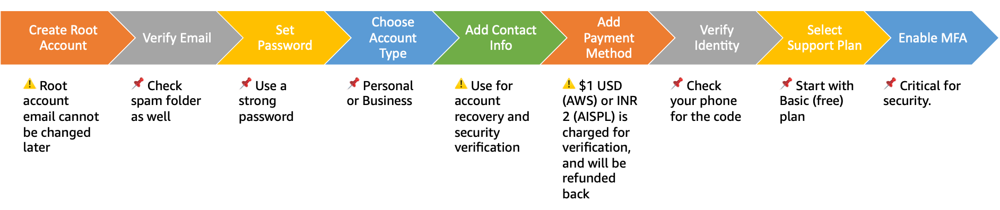

# 1.1 Creating Your AWS Account

Setting up your AWS account is the first step in your cloud journey. While AWS requires a credit card during signup for account verification and billing purposes, we understand your concerns about costs – that's why we've carefully designed this cookbook to operate within AWS Free Tier limits. You'll be able to learn and experiment with AWS services without incurring unexpected charges. For any services that might incur charges, we'll provide clear cost estimates beforehand. If a particular section might result in charges beyond the Free Tier, you'll see a cost warning box like this:

> 💰 Cost Warning
> Estimated cost for this section: $X.XX per month
> Affected services: [Service names]
> Free Tier coverage: [What's covered]

## Topics

- [Account Creation Flow](#account-creation-flow)
- [Quick Steps Overview](#quick-steps-overview)
- [Troubleshooting FAQ](#troubleshooting-faq)
- [Next Steps](#next-steps)
- [Learn More](#learn-more)

## Account Creation Flow



## Quick Steps Overview


1. Visit [sign up with AWS](https://aws.amazon.com/free/) and click "Create an AWS Account"

2. Enter email and account name

> 📌 **Tip:** For business accounts, use a role-based email (e.g., aws-admin@company.com) rather than a personal email.\
> ⚠️ **Warning:** The root account email cannot be changed after creation. Choose carefully!\
> 💡 **Best Practice:** Document the email used and store it in your company's secure knowledge base.

3. Verify email ownership

> 📌 **Tip:** Check spam folders if verification email doesn't arrive within 5 minutes.

4. Create root password

> 💡 **Best Practice:** Use a password manager to generate and store a strong password.

5. Select account type (Personal/Business)

> 📌 **Tip:** Choose 'Business' if:
> - Using for company purposes
> - Need consolidated billing
> - Plan to have multiple users
>
> 💡 **Best Practice** Even for personal projects, consider 'Business' if you might use it professionally later.

6. Add contact information

> ⚠️ **Warning:** Use accurate contact information - this is used for account recovery and security verification.\
> 💡 **Best Practice:** For business accounts, use company address and phone numbers rather than personal details.

7. Add payment method

> ⚠️ **Warning:** As part of card verification process, we will charge $1 USD (AWS) or INR 2 (AISPL) on your card when you complete the payments step. This will be refunded once your card has been validated. Your bank might take 3-5 days to reflect the refund on your account.\
> 💡 **Best Practice:** For business accounts, use a corporate card if available.

8. Verify identity via SMS/call

> 📌 **Tip:** Have your phone readily available for verification code.\
> 💡 **Best Practice:** If using a mobile number, ensure you have good signal coverage.

9. Choose support plan

> 📌 **Tip:** Start with Basic (free) plan - you can upgrade later if needed.\
> 💡 **Best Practice:** Review support plan features and upgrade when your production workload requires it.

10. Enable MFA (strongly recommended)

> ⚠️ **Warning:** This is a CRITICAL security step. Don't skip it!\
> 📌 **Available MFA Options:**
> - Virtual MFA (recommended for most users)
> - Hardware Security Key
> - Hardware Token

## Troubleshooting FAQ

### Email Verification Issues
```markdown
Q: Haven't received a verification email?
A: 1. Check spam folder
   2. Wait 5 minutes and request new code
   3. Try a different email provider if this persists

Q: Verification link expired?
A: Request new verification code from sign-up page
```

### Payment Verification Issues
```markdown
Q: Card being declined?
A: 1. Verify billing address matches exactly
   2. Ensure your card isn't blocked for international charges
   3. Contact card issuer if persistent

Q: Authorization charge showing?
A: This is normal - $1 hold will be released in 3-5 business days
```

### Identity Verification Issues
```markdown
Q: Not receiving SMS/call?
A: 1. Verify country code is correct
   2. Try alternative phone number
   3. Switch between SMS and voice call options

Q: Verification failing repeatedly?
A: Contact AWS Support at https://aws.amazon.com/contact-us/
```

### Account Creation Errors
```markdown
Q: "Account already exists"?
A: Try password recovery for existing account

Q: Region availability error?
A: Some services might not be available in all regions - select a different region
```

### MFA Setup Issues
```markdown
Q: QR code not scanning?
A: 1. Try manual code entry instead
   2. Adjust device brightness
   3. Use different authenticator app

Q: MFA codes not working?
A: 1. Verify device time is correct
   2. Wait full 30 seconds between codes
   3. Ensure you're entering the most recent code

Q: Lost MFA device?
A: 1. Use backup MFA device if configured
   2. Contact AWS Support with account details
   3. Prepare government ID for verification
```

## Next Steps

🎉 **Fantastic!** You've successfully created your AWS account and secured it with MFA. You now have access to the world's most comprehensive cloud platform!

**Ready to continue?** Let's advance to [1.2 Understanding AWS Free Tier and Cost Management](../1.2_Understanding_AWS_Free_Tier_and_Cost_Management) and keep building your Aurora mastery!

## Learn More

- [AWS Free Tier - Start building on AWS with 12 months of free services](https://aws.amazon.com/free/)
- [AWS Well-Architected Framework - Build secure, high-performing, resilient, and efficient infrastructure](https://aws.amazon.com/architecture/well-architected/)
- [AWS Getting Started Resource Center - Step-by-step guides and tutorials for beginners](https://aws.amazon.com/getting-started/)
- [AWS Account Setup Best Practices - Security and operational guidance for new accounts](https://docs.aws.amazon.com/accounts/latest/reference/best-practices.html)
