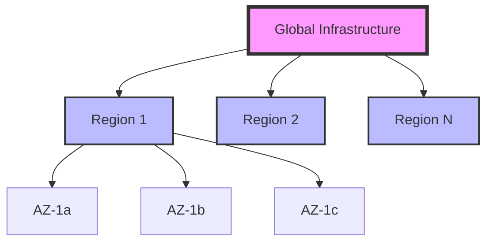
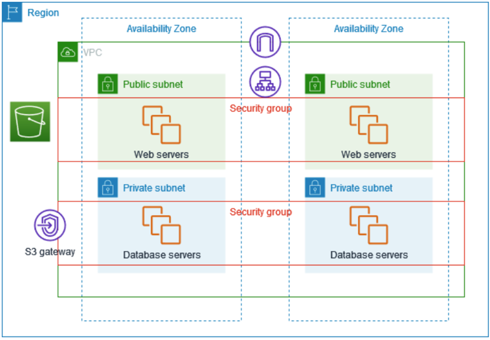
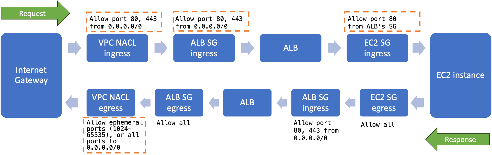
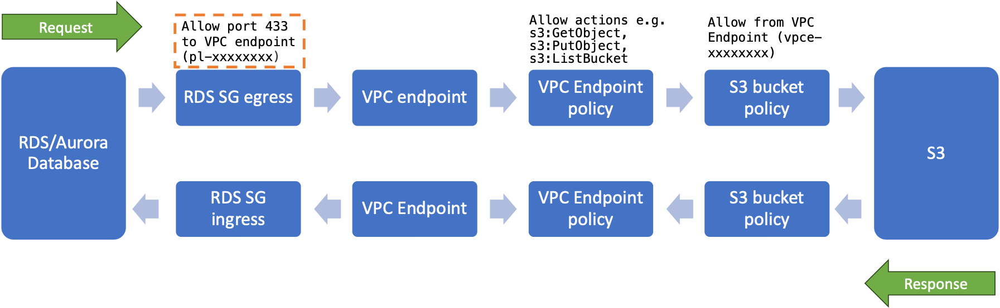

# 1.3 AWS Fundamentals: A Quick Tour

Think of AWS as a vast digital city where each service is like a specialized business district. Just as a city has residential areas, business centers, and industrial zones, AWS has different areas specialized for computing, storage, networking, database, and more. This tour will help you understand how these components work together to create secure, scalable applications.

## Topics

- [Global Infrastructure](#global-infrastructure)
- [Core Networking Concepts](#core-networking-concepts)
- [Identity and Access Management](#identity-and-access-management)
- [Modern Serverless Web Applications on AWS](#modern-serverless-web-applications-on-aws)
- [Take-aways and Next Steps](#take-aways-and-next-steps)
- [Next Steps](#next-steps)
- [Learn More](#learn-more)

## Global Infrastructure



Think of [AWS Regions](https://aws.amazon.com/about-aws/global-infrastructure/regions_az/) as major cities, each containing multiple [Availability Zones (AZs)](https://aws.amazon.com/about-aws/global-infrastructure/regions_az/) - like separate neighborhoods with their own power, networking, and facilities. These AZs are connected by high-speed, redundant networks, ensuring your applications remain available even if one zone experiences issues.

## Core Networking Concepts

### Virtual Private Cloud (VPC) and Subnets Basics

A [Virtual Private Cloud (VPC)](https://aws.amazon.com/vpc/) is your private section of the AWS cloud, providing a secure and isolated environment for your resources. Think of it as renting a secure office building where you control all access. Within this VPC, you can create subnets, which are like different floors or sections of your office building. Public subnets are like the lobby or reception area, accessible from the street (Internet), while private subnets are like secure back offices, not directly accessible from outside but still connected to the building's internal network. This setup allows you to design a layered architecture, placing public-facing resources (like web servers) in public subnets and sensitive resources (like databases) in private subnets for enhanced security.

```markdown
🏢 VPC (Virtual Private Cloud):
- Like a private, secure campus
- Isolated network environment
- Custom IP address range (e.g., 10.0.0.0/16)
- Spans multiple AZs

Example: A company VPC with IP range 10.0.0.0/16 contains:
- Public subnet (10.0.1.0/24): Web servers
- Private subnet (10.0.2.0/24): Database servers
```

### Security Layers

AWS provides multiple layers of security to protect your resources, similar to how a building has both perimeter security and individual room access controls.

```markdown
🔒 Security Groups (Instance Level)
- Like building security
- Stateful (remembers allowed connections)
- Allow rules only
- Applies to instances

Example: Web Server Security Group
- Inbound: Allow HTTP (80) from anywhere
- Inbound: Allow HTTPS (443) from anywhere
- Inbound: Allow SSH (22) from company IP
- Outbound: Allow all
```

### VPC Endpoint Usage

[VPC Endpoints](https://docs.aws.amazon.com/vpc/latest/privatelink/create-interface-endpoint.html) allow your resources to communicate with AWS services privately, like having a direct, private elevator to specific services.

```markdown
🔌 VPC Endpoints:
- Like private corridors to AWS services
- Avoids Internet exposure
- Types:
  └─ Interface Endpoints (powered by AWS PrivateLink)
  └─ Gateway Endpoints (e.g. Amazon S3 and Amazon DynamoDB)

Example: S3 Gateway Endpoint
- Allows Amazon EC2 instances in a private subnet to access Amazon S3
- Route table entry: pl-xxxxx for prefix 's3.amazonaws.com'
```

**Related AWS Services**
- **[Amazon EC2 (Elastic Compute Cloud)](https://aws.amazon.com/ec2/)**: Virtual servers in the cloud; can host web servers, application servers, etc.
- **[Amazon DynamoDB](https://aws.amazon.com/dynamodb/)**: Serverless, NoSQL, fully managed database with single-digit millisecond performance at any scale
- **[Amazon S3 (Simple Storage Service)](https://aws.amazon.com/s3/)**: Object storage service; used for storing and retrieving any amount of data
- **[AWS PrivateLink](https://aws.amazon.com/privatelink/)**: Establish connectivity between VPCs and AWS services without exposing data to the internet

### Practical Example: Secure Database Access



In this architecture, we have a secure multi-tier application deployed across multiple Availability Zones (AZs) for high availability. The web servers are placed in public subnets where they can receive Internet traffic through a load balancer, while the databases are safely tucked away in private subnets. Think of it as having your store's front desk in a public area while keeping your valuable inventory in a secure back room. The VPC endpoint acts like a private corridor, allowing your databases to securely access S3 without going through the public Internet.

#### 💡 **Key Networking & Security Terminology**

**Network Access Control**
- **[NACL (Network ACL)](https://docs.aws.amazon.com/vpc/latest/userguide/vpc-network-acls.html)**: **Stateless** firewall at subnet level; evaluates rules in numerical order
- **[SG (Security Group)](https://docs.aws.amazon.com/vpc/latest/userguide/vpc-security-groups.html)**: **Stateful** firewall at instance level; all rules evaluated before decision
- **[iptables](https://en.wikipedia.org/wiki/Iptables)**: Linux kernel firewall; filters packets based on defined rules

**Network Routing & Traffic**
- **[CIDR (Classless Inter-Domain Routing)](https://docs.aws.amazon.com/vpc/latest/userguide/vpc-cidr-blocks.html)**: IP address range notation (e.g., 10.0.0.0/16)
- **[Port](https://docs.aws.amazon.com/vpc/latest/userguide/vpc-security-groups.html)**: a software-defined number that identifies a specific process or service on a host (computer or server) (e.g. 5432 for PostgreSQL)
- **[Internet Gateway](https://docs.aws.amazon.com/vpc/latest/userguide/VPC_Internet_Gateway.html)**: Allows communication between VPC and Internet
- **[ALB (Application Load Balancer)](https://docs.aws.amazon.com/elasticloadbalancing/latest/application/introduction.html)**: Routes HTTP/HTTPS traffic to targets based on rules

**Related AWS Services**
- **[Amazon RDS (Relational Database Service) or Amazon Aurora](https://aws.amazon.com/rds/)**: Managed relational database service; supports various database engines (e.g., MySQL, PostgreSQL)

**Traffic Direction**
- **Ingress**: Incoming traffic to your resources
- **Egress**: Outgoing traffic from your resources

#### 💡 **Understanding Stateful vs Stateless Firewalls in AWS**

**Security Groups (Stateful)**
- Automatically allows return traffic for allowed inbound rules
- If inbound traffic is allowed on port 80, the response can automatically go out
- No need to explicitly configure outbound rules for response traffic
- Example: If you allow inbound HTTP (80), your web server can automatically respond, regardless of outbound rules

**Network ACLs (Stateless)**
- Must explicitly allow both inbound and outbound traffic
- If you allow inbound traffic on port 80, you must also explicitly allow outbound ephemeral ports for the response
- Each direction (in/out) evaluated independently
- Example: For web traffic, you need:
  * Inbound rule: Allow TCP 80 from 0.0.0.0/0
  * Outbound rule: Allow TCP 1024-65535 to 0.0.0.0/0 (for responses)

>  📌 **Tips:**
>
> - Use Security Group references (sg-xxxxx) in the Security Group rules instead of CIDR when possible as the instance IPs can always change.
> - Allow all traffic from the security group itself
> - Keep default outbound rules (allow all) in Security Groups

#### 1. Public Access to Web Server

>  📌 **Tips:**
>
> - Focus on the settings highlighted by the orange dotted box, and leave the rest of them as default values until you are familiar with the settings.



```markdown
NACL Rules:
- Inbound: Allow ports HTTP (80), HTTPS (443) from 0.0.0.0/0
- Outbound: Allow ephemeral ports (1024-65535), or all ports to 0.0.0.0/0

Load Balancer (ALB):
- Listens on ports HTTP (80), HTTPS (443)
- Forwards to web servers on port 80
- SSL termination at ALB

ALB Security Group:
- Inbound: Allow HTTP (80), HTTPS (443) from 0.0.0.0/0
- Outbound: Allow port 80 to EC2 Security Group for forwarding requests to the web servers; Allow ephemeral ports (1024-65535) for the return traffic of incoming requests; Or all ports to 0.0.0.0/0.

Web Server (EC2) Security Group:
- Inbound: Allow port 80 from ALB Security Group (only)
- Outbound: Allow ephemeral ports (1024-65535) for the return traffic of incoming requests, or allow all ports

Return Traffic:
- EC2 responses on port 80 to ALB
- ALB responds on ports 80/443 to clients
```

#### 2. Web Server to RDS Connection

>  📌 **Tips:**
>
> - Focus on the settings highlighted by the orange dotted box, and leave the rest of them as default values until you are familiar with the settings.


```markdown
Web Server (EC2) Side:
- iptables outbound chain: Allow outbound to port 5432 to RDS Private Subnet CIDR
- iptables inbound chain: Allow inbound ephemeral ports (1024-65535) from RDS Private Subnet CIDR
- Security Group egress: Allow port 5432 to RDS Security Group
- NACL egress: Allow port 5432 to RDS Private Subnet CIDR
- NACL ingress: Allow ephemeral ports (1024-65535) from RDS Private Subnet CIDR

RDS Side:
- NACL ingress: Allow port 5432 from Web Tier Subnet CIDR
- NACL egress: Allow ephemeral ports (1024-65535) to Web Tier Subnet CIDR
- Security Group ingress: Allow port 5432 from Web Server Security Group

Return Traffic Flow:
- RDS responds using ephemeral ports (1024-65535)
- Response travels back through security layers
- Web server receives response on original connection port

Note: Security Groups are stateful, so return traffic is automatically allowed once the initial connection is permitted.
```

#### 3. RDS to S3 via VPC Endpoint

>  📌 **Tips:**
>
> - Focus on the settings highlighted by the orange dotted box, and leave the rest of them as default values until you are familiar with the settings.



```markdown
RDS Security Group:
- Egress: Allow HTTPS (443) to VPC Endpoint prefix list (pl-xxxxxxxx)

VPC Endpoint Policy:
- Allow actions e.g. s3:GetObject, s3:PutObject, s3:ListBucket
- Resource: 
  * arn:aws:s3:::my-bucket/*
  * arn:aws:s3:::my-bucket

S3 Bucket Policy:
- Effect: Allow
- Principal: AWS account
- Condition: Allow (only) from VPC Endpoint (vpce-xxxxxxxx)
```

## Identity and Access Management

### Core IAM Concepts

IAM provides several tools to manage identities and their permissions, similar to how a company manages employee access cards and security clearances.

```markdown
👤 Users:
- Individual identities
- Long-term credentials
- Specific permissions

Example: Database Administrator
- Username: db-admin
- Permissions: Full access to RDS
- MFA enabled
- Access key for CLI access
```

```markdown
👥 Groups:
- Collection of users
- Shared permissions
- Easier management

Example: Database Team
- Group Name: Database-Admins
- Members: 
  └─ dba-alice@company.com
  └─ dba-bob@company.com
  └─ dba-carol@company.com
- Attached Policies:
  └─ AmazonRDSFullAccess (AWS Managed Policy)
  └─ Custom-RDS-Backup (for backup/restore operations)
  └─ Custom-RDS-Monitoring (for Performance Insights & CloudWatch)
- Use Case: Centrally manage permissions for all database administrators
```

```markdown
🎭 Roles:
- Temporary credentials
- Used by services/applications
- Cross-account access

Example: RDS-IAM-Access-Role
- Role Name: WebApp-RDS-ReadWrite
- Trusted Entity: EC2 service
- Use Case: Allows EC2 instances to authenticate to RDS using IAM
- Permissions: Allows generation of auth token for RDS access
- Associated Policy: RDS-IAM-Auth-Policy (see policy example below)
```

```markdown
📜 Policies:
- Permission definitions
- JSON documents
- Attached to identities

Example: RDS-IAM-Auth-Policy
- Policy Name: RDS-IAM-Auth-WebApp
- Policy Type: Customer managed
- JSON Document:
  {
    "Version": "2012-10-17",
    "Statement": [
      {
        "Effect": "Allow",
        "Action": [
          "rds-db:connect"
        ],
        "Resource": [
          "arn:aws:rds-db:us-east-1:123456789012:dbuser:db-ABCDEFGHIJKLMNOPQRSTU/webapp_user"
        ]
      }
    ]
  }
- Attached to: WebApp-RDS-ReadWrite role
```

This example demonstrates:

1. A role (WebApp-RDS-ReadWrite) that can be assumed by EC2 instances running the web application.
2. A policy (RDS-IAM-Auth-Policy) that allows the role to authenticate to a specific RDS database using IAM.

Key points:
- The `rds-db:connect` action allows generation of an authentication token for RDS.
- The Resource ARN specifies the exact database and database user that can be accessed.
- This setup allows for fine-grained control over database access without managing database passwords.
- Credentials are short-lived and automatically rotated, enhancing security.

To use this in an application:
1. The EC2 instance assumes the WebApp-RDS-ReadWrite role.
2. The application uses AWS SDK to get a token for RDS authentication.
3. This token is used instead of a password to connect to the RDS instance.

This method significantly enhances database security by eliminating the need for long-term database credentials in application code or configuration files.

### Security Best Practices

Implementing IAM effectively requires adherence to security best practices, like having strict protocols for handling company security badges.

```markdown
✅ Follow these guidelines:
1. Use least privilege access
2. Enable MFA
3. Rotate credentials
4. Use roles instead of keys
5. Regular access reviews

Example: Application Deployment Role
- Name: web-app-deploy-role
- Trusted Entity: EC2 service
- Permissions: 
  └─ Read-only S3 access
  └─ CloudWatch logs access
  └─ No permanent access keys needed
```

## Modern Serverless Web Applications on AWS

Think of a modern serverless application like a smart building that automatically scales its services based on visitor traffic, with no need to manage the underlying infrastructure. Here's how AWS services work together:

### The Building Blocks

#### 1. Presentation Tier (User Interface)
```markdown
🏢 Public-Facing Components:
- CloudFront: Global content delivery network
  └─ Like a network of local offices serving users from the nearest location
- S3: Static content storage
  └─ Your content library (images, videos, web assets)
- API Gateway: API management
  └─ Your intelligent reception desk, routing requests to the right department
```

#### 2. Application Tier (Business Logic)
```markdown
🏢 Processing Layer:
- Lambda: Serverless compute
  └─ On-demand workers that appear only when needed
- Step Functions: Workflow orchestration
  └─ Your workflow manager, coordinating complex processes
```

#### 3. Data Tier (Storage & Caching)
```markdown
🏢 Data Services:
- DynamoDB: NoSQL database
  └─ Fast, flexible document storage
- RDS: Relational database
  └─ Structured data storage for complex queries
- ElastiCache: In-memory caching
  └─ High-speed temporary storage for frequent requests
```

#### 4. Supporting Services
```markdown
🏗️ Infrastructure Components:
- Cognito: User authentication
  └─ Your security system for user access
- CloudWatch: Monitoring
  └─ Your building's monitoring and alarm system
- WAF: Security
  └─ Your security guard against web attacks
- Route 53: DNS management
  └─ Your building's directory and navigation system
```

#### How It All Works Together

A typical request flows through the system like this:

```markdown
1. User Access
   └─ User visits your website through CloudFront
   └─ Static content served from S3
   └─ WAF protects against malicious requests

2. Authentication
   └─ Cognito verifies user identity
   └─ Issues temporary security credentials

3. API Interaction
   └─ API Gateway receives authenticated request
   └─ Routes to appropriate Lambda function

4. Business Logic
   └─ Lambda processes the request
   └─ Interacts with necessary data stores
   └─ Executes business logic

5. Data Operations
   └─ DynamoDB for high-speed NoSQL operations
   └─ RDS for complex relational data
   └─ ElastiCache for frequently accessed data

6. Response
   └─ Results return through API Gateway
   └─ CloudWatch monitors entire process
```
### What You've Learned

🎓 **Core Concepts:**
- AWS global infrastructure
- Network security fundamentals
- Identity management
- Serverless architectures

🛠️ **Practical Skills:**
- VPC design principles
- Security implementation
- Web application architecture

## Take-aways and Next Steps

The above AWS fundamentals might seem overwhelming at first glance, but don't worry - you don't need to master every concept before getting started. Think of it as learning a new city: you start by understanding the basic layout (Global Infrastructure), knowing how to get around safely (Networking and Security), and learning who can access what (IAM).

These concepts will come alive as you progress through hands-on examples in this cookbook. You'll start with creating your first PostgreSQL database on AWS, where you'll see networking and security concepts in action. Then, you'll build a serverless web application that brings together IAM roles, API Gateway, and Lambda functions. Finally, you'll create your first Generative AI application, where you'll see how these foundational services can be combined with AWS's advanced AI capabilities.

Remember, AWS is designed to be modular - you can start with the basics and gradually incorporate more advanced features as your needs grow. Our CloudFormation templates will handle much of the initial complexity, allowing you to focus on understanding the components and their interactions.

## Next Steps

🎉 **Excellent!** You've gained essential knowledge of AWS networking, security, and core services. You now understand how the pieces fit together!

**Ready to continue?** Let's advance to [1.4 Setting up Your Cookbook Environment](../1.4_Setting_up_Your_Cookbook_Environment) and keep building your Aurora mastery!

## Learn More

- [AWS Free Tier - Start building on AWS with 12 months of free services](https://aws.amazon.com/free/)
- [AWS Well-Architected Framework - Build secure, high-performing, resilient, and efficient infrastructure](https://aws.amazon.com/architecture/well-architected/)
- [AWS Getting Started Resource Center - Step-by-step guides and tutorials for beginners](https://aws.amazon.com/getting-started/)
- [AWS Account Setup Best Practices - Security and operational guidance for new accounts](https://docs.aws.amazon.com/accounts/latest/reference/best-practices.html)
