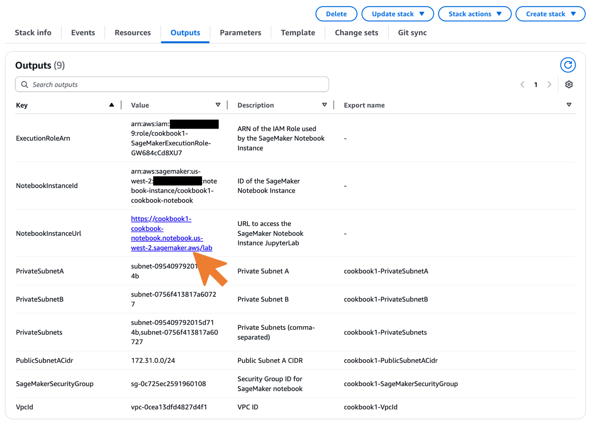

# 1.4 Setting up your Cookbook Environment

This cookbook provides two convenient ways to explore and learn AWS services: automated infrastructure deployment using [AWS CloudFormation](https://aws.amazon.com/cloudformation/) and interactive code examples using Jupyter notebooks. Let's understand each component and how to set up your environment.

## Topics

- [Infrastructure Deployment with AWS CloudFormation](#infrastructure-deployment-with-aws-cloudformation)
- [Repository Setup](#repository-setup)
- [Interactive Learning with Jupyter Notebooks](#interactive-learning-with-jupyter-notebooks)
- [Next Steps](#next-steps)
- [Learn More](#learn-more)

## Infrastructure Deployment with AWS CloudFormation

AWS CloudFormation is AWS's infrastructure as code service that allows you to create and manage AWS resources through templates. Think of it as a blueprint for your AWS resources - you declare what you want, and CloudFormation handles the creation and configuration automatically.

```markdown
🚀 What CloudFormation Does:
- Automates infrastructure deployment
- Ensures consistent configurations
- Manages dependencies between resources
- Enables version control of infrastructure
```

For this cookbook, we provide pre-built AWS CloudFormation templates that you can deploy with a single click:

```markdown
📦 Our Templates Include:
- Network infrastructure (VPC, subnets)
- Application components
- Database configurations
- Security settings
- Monitoring setup
```

## Repository Setup

Before working with the cookbook, you'll need to clone or fork the repository to your local machine or development environment.

### Prerequisites
- Git installed on your system
- GitHub/GitLab account (for forking)

### Installing Git

**macOS:**
```bash
# Using Homebrew
brew install git

# Or download from https://git-scm.com/download/mac
```

**Windows:**
```bash
# Download from https://git-scm.com/download/windows
# Or using Chocolatey
choco install git
```

**Linux (Ubuntu/Debian):**
```bash
sudo apt update
sudo apt install git
```

### Repository Setup Options

**Option A - Fork (Recommended for contributions):**
1. Fork the repository on GitLab/GitHub
2. Clone your fork:
   ```bash
   git clone https://gitlab.com/YOUR_USERNAME/db-cookbook.git
   cd db-cookbook
   ```

**Option B - Direct Clone (Read-only):**
```bash
git clone https://gitlab.com/ORIGINAL_REPO/db-cookbook.git
cd db-cookbook
```

**Verify Setup:**
```bash
# Check git installation
git --version

# Verify repository structure
ls -la
```

## Interactive Learning with Jupyter Notebooks

Jupyter notebooks are interactive documents that combine live code, equations, visualizations, and narrative text. They're perfect for learning as you can:
- Run code snippets and see results immediately
- Modify examples and experiment
- Add notes and documentation
- Share your work with others

### Method 1: Using Amazon SageMaker Jupyter Notebooks (recommended)

Launch a free tier Amazon SageMaker Jupyter Notebook by [one-click AWS CloudFormation deployment](https://console.aws.amazon.com/cloudformation/home/#/stacks/create/template?stackName=SageMakerNotebook&templateSource=Upload) - download the [template file](../cfn/sagemaker-notebook-template.yaml) first and upload it.

✅ Advantages:
- Fully managed environment
- Pre-configured AWS credentials
- No local setup required
- Consistent experience

💰 Cost Consideration:
- SageMaker notebook instances are billed hourly ([250 hours of ml.t3.medium instance on on-demand notebook instances is free](https://aws.amazon.com/pm/sagemaker/)).
- The SageMaker notebook instances created by the [AWS CloudFormation template](../cfn/sagemaker-notebook-template.yaml) comes with 5GB EBS volume. Depending on the region where the SageMaker notebook instances is launched, the price is different. For example, in Virginia region, the monthly cost for 5GB General Purpose SSD is 5 GB per month x 0.14 USD = 0.70 USD. See [Amazon SageMaker AI pricing](https://aws.amazon.com/sagemaker-ai/pricing/) for up to date pricing information.
- Monitor [AWS Free Tier usage](../1.2_Understanding_AWS_Free_Tier_and_Cost_Management/README.MD).
- Remember to stop instance when not in use. The [AWS CloudFormation template](../cfn/sagemaker-notebook-template.yaml) auto shuts down the instance after 1 hour of inactivity.

🔧 Setup Steps:
1. **Deploy SageMaker Notebook:**
   - Click the [AWS CloudFormation deployment link](https://console.aws.amazon.com/cloudformation/home/#/stacks/create/template?stackName=SageMakerNotebook&templateSource=Upload)
   - Download and upload the [template file](../cfn/sagemaker-notebook-template.yaml)
   - Follow the AWS CloudFormation deployment wizard
   - Wait for stack creation to complete

2. **Setup Repository** (see [Repository Setup](#repository-setup) section above)

> 💡 **Note**: The SageMaker Notebook will clone the repository after launch. It will take a few minutes to install the prerequisites and packages needed, and clone the repository.

3. **Access SageMaker Notebook:**
   - Go to [AWS CloudFormation Console](https://console.aws.amazon.com/cloudformation/home/#/stacks) and find your stack
   - Click on the **Outputs** tab
   - Click the **NotebookInstanceUrl** link to open JupyterLab directly



4. **Select Kernel and Start Exploring:**
   - Use the **`conda_python3`** kernel for all cookbook notebooks
   - This kernel includes all required libraries: boto3, psycopg2, pandas, and AWS integrations
   - Start exploring the notebooks in the cloned repository


### Method 2: Running Jupyter Locally

✅ Advantages:
- No AWS compute costs
- Use your preferred local setup
- Offline work possible
- Custom environment control

🔒 Network Considerations:
- Ensure AWS services are accessible, for example:
   - RDS databases need public subnet placement. Refer to [enable internet access for a VPC using an internet gateway](https://docs.aws.amazon.com/vpc/latest/userguide/VPC_Internet_Gateway.html#Add_IGW_Attach_Gateway)
   - Change the RDS databases with Publicly Accessible. Refer to [How can I configure private and public Aurora endpoints in the Amazon RDS console?](https://repost.aws/knowledge-center/aurora-private-public-endpoints)
   - Security groups must allow your IP. Refer to [Configure security group rules](https://docs.aws.amazon.com/vpc/latest/userguide/working-with-security-group-rules.html)
   - Consider VPN for private resources

⚠️ Requirements:
1. Python installed locally
2. AWS CLI configured
3. Jupyter notebook installed
4. Proper network access to AWS services

🔧 Setup Steps:
1. Install Python requirements:
```bash
pip install jupyter boto3
```
> 💡 **Note**: There are other packages needed. Check the prerequisite section from the Jupyter notebook.

2. Configure AWS credentials:
```bash
aws configure
```
3. Setup Repository (see [Repository Setup](#repository-setup) section above)
4. Launch Jupyter:
```bash
jupyter notebook
```

## Next Steps

🎉 **Outstanding!** Your development environment is ready with CloudFormation templates and Jupyter notebooks. You're all set for hands-on learning!

**Ready to continue?** Let's advance to [2. Your First Database on AWS](../../2_Your_First_Database_on_AWS/README.MD) and keep building your AWS database mastery!

## Learn More

- [AWS Free Tier - Start building on AWS with 12 months of free services](https://aws.amazon.com/free/)
- [AWS Well-Architected Framework - Build secure, high-performing, resilient, and efficient infrastructure](https://aws.amazon.com/architecture/well-architected/)
- [AWS Getting Started Resource Center - Step-by-step guides and tutorials for beginners](https://aws.amazon.com/getting-started/)
- [AWS Account Setup Best Practices - Security and operational guidance for new accounts](https://docs.aws.amazon.com/accounts/latest/reference/best-practices.html)
