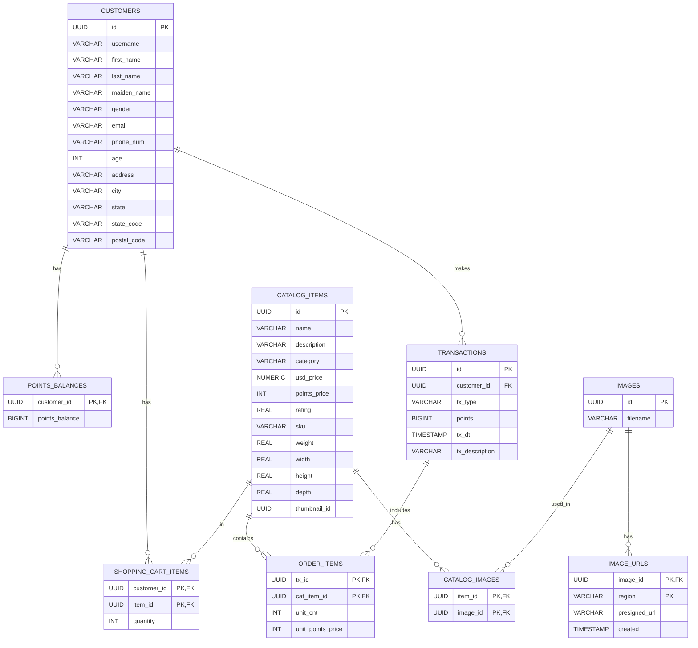

# 2.2 Connecting to Your Aurora Database

This section guides you through connecting to your newly created Aurora PostgreSQL database using various methods. We'll explore secure and efficient ways to interact with your database, suitable for different use cases and application architectures.

> **💡 Prerequisite**: You have completed section [2.1 Creating your first Aurora cluster](../2.1_Crearting_Your_First_Aurora_Cluster/2.1.2_create_your_first_aurora_postgresql_part2.ipynb) or have launched the infrastructure with our [CloudFormation template](../codes/cfn/aurora-complete.yaml). 

> 💡 **Note**: Ready for hands-on Aurora experience? The [Aurora PostgreSQL Workshop](https://catalog.workshops.aws/apgimmday/en-US) provides interactive labs where you\'ll build real applications. You\'ll gain practical skills in cluster management, performance tuning, and high availability that directly apply to production workloads.

## Topics

- [What We'll Build](#what-well-build)
- [Database Schema Design](#database-schema-design)
- [Next Steps](#next-steps)
- [Learn More](#learn-more)

## What We'll Build

We will build a rewards program database. This database will be used to build a serverless retail web application in the next section [3 Building Your First Serverless Web App with Aurora](../../3_Building_Your_First_Serverless_Web_App_with_Aurora/README.MD)

1. Start with [Basic Connectivity](./2.2.1_Basic_Connectivity.ipynb) to ensure you can connect to your database
2. Proceed to [Working with Data](./2.2.2_Working_with_Data.ipynb) to create and populate your tables
3. Finally, implement [Advanced Connection Management](./2.2.3_Advanced_Connection_Management.ipynb) for production-ready setup

> 💡 **Note**: Struggling with database connections at scale? Learn about [RDS Proxy](https://docs.aws.amazon.com/AmazonRDS/latest/AuroraUserGuide/rds-proxy.html) which can reduce connection overhead by up to 50%. This fully managed service pools and shares connections, preventing "too many connections" errors while improving application resilience.

## Database Schema Design

This Entity-Relationship (ER) diagram represents a rewards program database structure. Here's a brief overview:

- **CUSTOMERS** are the core entity, with personal information and unique identifiers.
- **CATALOG_ITEMS** represent products available for purchase or redemption.
- **TRANSACTIONS** record point-based activities (earning or redeeming).
- **ORDER_ITEMS** link transactions to specific catalog items.
- **POINTS_BALANCES** track each customer's current points.
- **SHOPPING_CART_ITEMS** represent items customers have selected but not yet purchased.
- **IMAGES** and **IMAGE_URLS** manage product visuals across regions.

This structure allows for a flexible rewards system with product catalog management, transaction tracking, and customer data handling. As you work through this section, you'll create these tables and populate them with sample data to simulate a real-world application.

## Next Steps

🎉 **Amazing!** You've mastered Aurora connectivity, from [Basic Connectivity](./2.2.1_Basic_Connectivity.ipynb), [Working with Data](./2.2.2_Working_with_Data.ipynb) to [Advanced Connection Management](./2.2.3_Advanced_Connection_Management.ipynb). Your database skills are growing strong!

**Ready to continue?** Let's advance to [3. Building Your First Serverless Web App with Amazon Aurora](../../3_Building_Your_First_Serverless_Web_App_with_Aurora/README.MD) and keep building your AWS database mastery!

## Learn More

- [Streamline Amazon Aurora database operations at scale: Introducing the AWS Database Acceleration Toolkit](https://aws.amazon.com/blogs/database/streamline-amazon-aurora-database-operations-at-scale-introducing-the-aws-database-acceleration-toolkit/)
- [Aurora PostgreSQL Workshop - Hands-on lab for building PostgreSQL applications](https://catalog.workshops.aws/apgimmday/en-US)
- [Aurora MySQL Workshop - Interactive tutorial for MySQL database development](https://catalog.workshops.aws/awsauroramysql/en-US)
- [Aurora Best Practices Guide - Production-ready configuration and optimization tips](https://docs.aws.amazon.com/AmazonRDS/latest/AuroraUserGuide/Aurora.BestPractices.html)
- [Aurora User Guide - Complete reference for Amazon Aurora database service](https://docs.aws.amazon.com/AmazonRDS/latest/AuroraUserGuide/)
