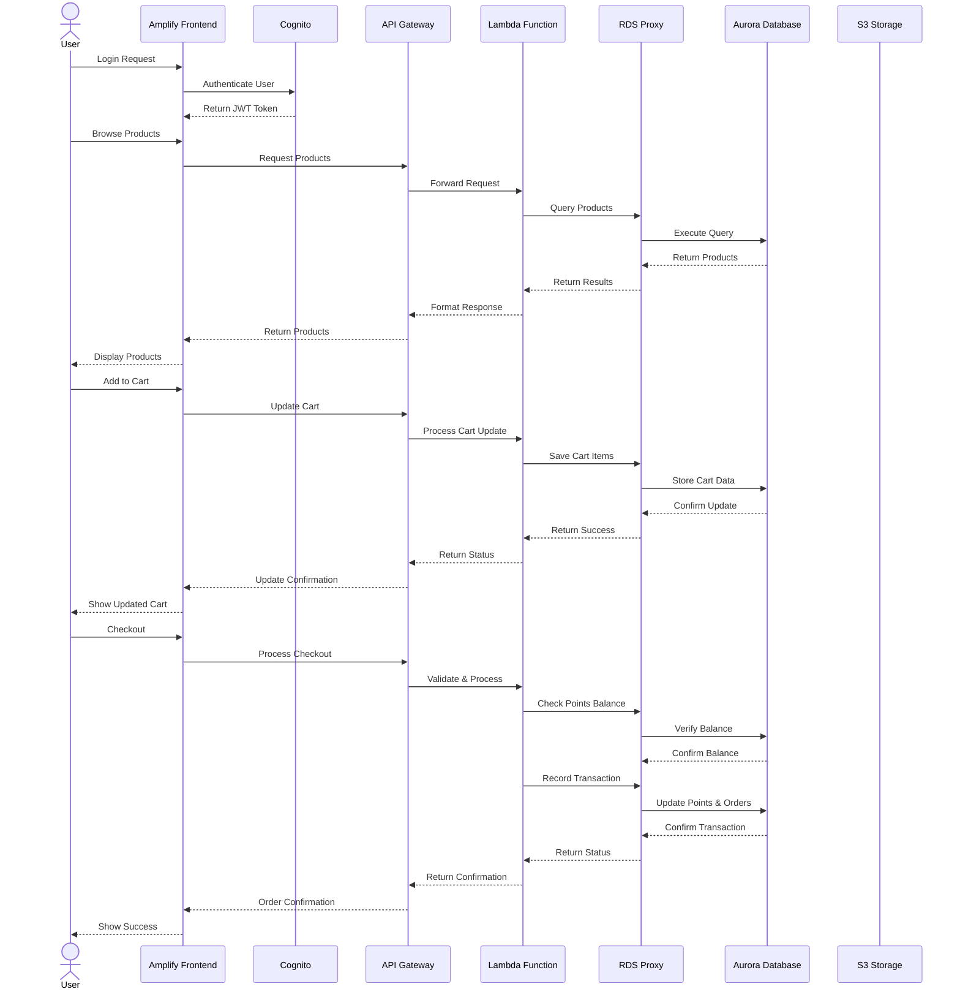

# 3.1 Design Your Serverless Architecture

🏗️ **Blueprinting the Future of Retail Rewards**

Welcome to the architect's table! In this section, we'll sketch the blueprint for a modern, scalable rewards application that delights customers while keeping your operations team sleeping soundly at night. Get ready to transform traditional retail loyalty programs into a cloud-native powerhouse that scales effortlessly and responds instantly to customer interactions.

> **💡 Quick Start Available**: Want to skip the manual setup to launch your first serverless application? Launch the infrastructure with our [CloudFormation template](../rewards-app-example/deployment-guide.ipynb), and follow the [deployment instructions](../rewards-app-example/deployment-guide.ipynb) to quickly deploy the solution. Then, feel free to explore from the [AWS console](https://us-east-1.console.aws.amazon.com/rds) for what you have created.

## Topics

- [Design Requirements](#design-requirements)
- [Architecture Overview](#architecture-overview)
- [Application Flow](#application-flow)
- [How the Architecture Addresses Requirements](#how-the-architecture-addresses-requirements)
- [Key Design Decisions](#key-design-decisions)
- [Reference Implementation](#reference-implementation)

## Design Requirements

Before diving into the architecture, let's understand the key requirements that drive our design decisions:

* **Always Available, Always Fast**
  - The application must be accessible 24/7 with minimal downtime
  - Fast response times even during traffic spikes
  - Ability to handle varying loads efficiently
  - Smooth performance across different network conditions

* **Safe and Secure**
  - Robust user authentication and authorization
  - Secure data storage and transmission
  - Protection of sensitive customer information
  - Comprehensive transaction history and audit trails

* **Reliable and Trustworthy**
  - Accurate tracking of points and transactions
  - Consistent data across all operations
  - Resilient to failures and errors
  - Transparent processing of user requests

* **Smart and Efficient**
  - Optimized for cost and performance
  - Scalable architecture that grows with demand
  - Efficient use of computing resources
  - Minimal operational overhead

## Architecture Overview

The Xanadu Rewards Application demonstrates a modern serverless architecture with the following components:

- **Frontend**: React application hosted on AWS Amplify for CI/CD and hosting
- **API Layer**: Amazon API Gateway with RESTful endpoints and usage plans
- **Business Logic**: AWS Lambda functions with IAM roles for secure access control
- **Database**: Amazon Aurora PostgreSQL Serverless v2 with RDS Proxy for connection pooling
- **Authentication**: Amazon Cognito for user management and JWT-based authentication
- **Security**: AWS Secrets Manager for credential storage and IAM for fine-grained permissions
- **Infrastructure**: AWS CloudFormation for infrastructure as code deployment

## Application Flow

### Typical User Flow:

1. **User Authentication**
   - User logs in through the Amplify frontend
   - Cognito authenticates and provides JWT tokens
   - Frontend stores tokens for subsequent API calls

2. **Browsing Products**
   - Frontend requests product data from API Gateway
   - API Gateway routes request to Lambda function
   - Lambda queries Aurora database through RDS Proxy
   - Data flows back to the user through the same path

3. **Cart Management**
   - User adds items to cart (stored in frontend state)
   - Cart is persisted to database when user is authenticated
   - Updates are sent through API Gateway to Lambda

4. **Checkout Process**
   - User initiates checkout from cart
   - Lambda validates points balance in Aurora
   - Transaction is processed and recorded in database
   - Confirmation is returned to the user

5. **Points Management**
   - Points balance is updated after successful transactions
   - Transaction history is stored in Aurora
   - User can view history and current balance through the UI

## How the Architecture Addresses Requirements

### Always Available, Always Fast
- **Aurora Serverless v2** automatically scales to meet demand without downtime
- **API Gateway** handles high request volumes with low latency
- **Lambda** functions scale instantly to process concurrent requests
- **Amplify** delivers frontend content via CDN for fast global access

### Safe and Secure
- **Cognito** provides robust authentication and authorization
- **API Gateway** validates tokens and enforces access control
- **Secrets Manager** securely stores database credentials
- **IAM roles** enforce least-privilege access for all components

### Reliable and Trustworthy
- **Aurora** offers 99.99% availability with automated failover
- **RDS Proxy** improves resilience to database connection issues
- **Lambda** retries and error handling ensure transaction reliability
- **CloudWatch** monitoring provides visibility into system health

### Smart and Efficient
- **Serverless architecture** eliminates idle resource costs
- **Pay-per-use** model for all components (Lambda, Aurora, API Gateway)
- **Connection pooling** optimizes database resource utilization
- **CloudFormation** enables consistent, repeatable deployments

## Key Design Decisions

### Database Selection
- **Aurora PostgreSQL Serverless v2** was chosen for:
  - Automatic scaling based on workload
  - Pay-per-use pricing model
  - PostgreSQL compatibility
  - High availability with multi-AZ deployment

### Connection Management
- **Amazon RDS Proxy** is used to:
  - Pool and share database connections
  - Reduce connection overhead on the database
  - Improve application resilience to database failures
  - Handle connection surges from Lambda functions

### API Design
- **RESTful API** with clear resource paths
- Separation of public and authenticated endpoints
- Comprehensive CORS support for browser-based applications

### Authentication Flow
- Token-based authentication with Amazon Cognito
- JWT validation in API Gateway
- Fine-grained access control for protected resources

### Serverless Compute
- Lambda functions organized by domain (products, cart, points)
- Shared code through Lambda Layers
- Event-driven processing for asynchronous operations

## Reference Implementation

The complete reference implementation is available in the [rewards-app-example](../rewards-app-example) directory. This implementation showcases:

- Separation of concerns with modular code organization
- Database access patterns for serverless applications
- Authentication and authorization flows
- Frontend-backend integration

## Next Steps

🎉 **Brilliant!** You've designed a complete serverless architecture that scales automatically. Your architectural thinking is spot-on!

**Ready to continue?** Let's advance to [3.2 Implementing the Backend](../3.2_Implementing_the_Backend) and keep building your Aurora mastery!

## Learn More

- [Serverless Application Lens - Well-Architected guidance for serverless workloads](https://docs.aws.amazon.com/wellarchitected/latest/serverless-applications-lens/)
- [Aurora Serverless v2 Workshop - Build auto-scaling serverless database applications](https://catalog.workshops.aws/apgimmday/en-US/performance-and-scalability/aurora-serverless-v2)
- [Serverless Web Applications Workshop - End-to-end serverless application development](https://webapp.serverlessworkshops.io/)
- [Aurora Serverless v2 Guide - Automatic scaling database for variable workloads](https://docs.aws.amazon.com/AmazonRDS/latest/AuroraUserGuide/aurora-serverless-v2.html)
