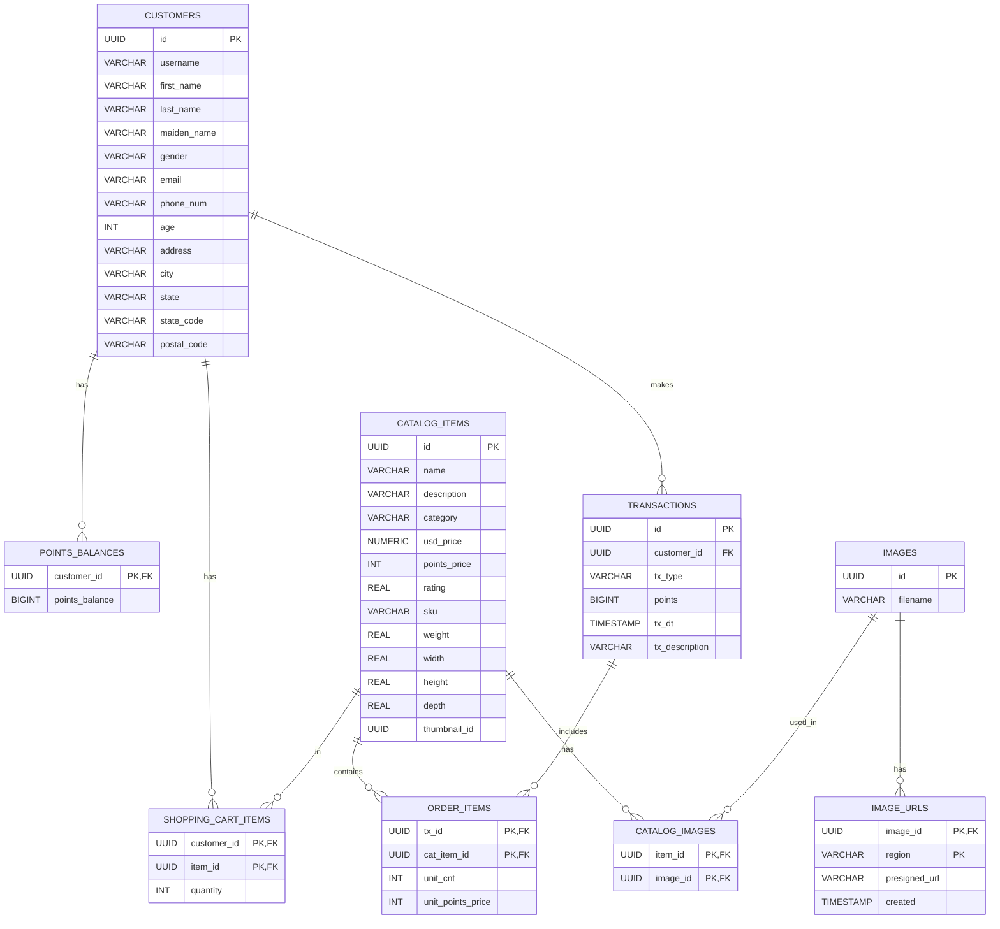

# 3.2 Implementing the Backend

🚀 **From Design to Reality: Building Your Serverless Backend**

Roll up your sleeves—it's time to bring our architectural vision to life! In this hands-on section, we'll transform blueprints into working code, crafting a powerful serverless backend that handles everything from product browsing to points redemption. You'll see how Aurora PostgreSQL Serverless v2 becomes the beating heart of our application, storing and retrieving data with lightning speed while scaling automatically to meet demand.

> **💡 Quick Start Available**: Want to skip the manual setup to launch your first serverless application? Launch the infrastructure with our [CloudFormation template](../rewards-app-example/deployment-guide.ipynb), and follow the [deployment instructions](../rewards-app-example/deployment-guide.ipynb) to quickly deploy the solution. Then, feel free to explore from the [AWS console](https://us-east-1.console.aws.amazon.com/rds) for what you have created.

## Topics

- [Backend Components](#backend-components)
- [Lambda Function Structure](#lambda-function-structure)
- [Database Schema](#database-schema)
- [API Endpoints](#api-endpoints)
- [Deployment](#deployment)

## Backend Components

The backend consists of several AWS services working together:

1. **Amazon API Gateway**: Provides RESTful API endpoints
2. **AWS Lambda**: Handles business logic and database operations
3. **Amazon Aurora PostgreSQL Serverless v2**: Stores application data
4. **Amazon RDS Proxy**: Manages database connections
5. **AWS Secrets Manager**: Securely stores database credentials
6. **Amazon Cognito**: Handles user authentication and authorization

## Lambda Function Structure

The main Lambda function is organized into modules:

```
xanadu-app-lambda-functions/
├── config/
│   └── database.js         # Database configuration
├── src/
│   ├── handlers/           # API endpoint handlers
│   ├── models/             # Data models
│   ├── utils/              # Utility functions
│   └── index.js            # Main Lambda handler
└── package.json            # Node.js dependencies
```

### Key Implementation Features

1. **Database Connection Pooling**
   - Uses RDS Proxy for efficient connection management
   - Implements connection reuse patterns for Lambda

2. **API Handlers**
   - Modular handlers organized by domain
   - Consistent error handling and response formatting
   - CORS support for browser-based applications

3. **Data Models**
   - Encapsulates database operations
   - Implements business logic validation
   - Provides clean interfaces for handlers

4. **Authentication Integration**
   - JWT validation for protected endpoints
   - Role-based access control
   - Public endpoints for unauthenticated access

## Database Schema

The application uses a relational database schema with tables to ensure robust transaction handling and ACID compliance leveraging Amazon Aurora PostgreSQL's distributed architecture. The system benefits from Aurora's storage-based replication with 6-way replication across 3 Availability Zones, providing 99.99% availability and self-healing storage. High availability is achieved through Aurora's automated failover mechanism, typically completing within 30 seconds, supported by Aurora Replicas that can be promoted to primary instances. Durability is ensured through continuous backup to Amazon S3, allowing point-in-time recovery up to the last 35 days, while Aurora's distributed storage system automatically handles data replication, backup, and failover operations. Performance is enhanced through Aurora's distributed storage that improves throughput while maintaining PostgreSQL compatibility, and connection pooling is managed through Amazon RDS Proxy to handle high-concurrency workloads efficiently.

> **💡 Note**: Ready to launch your first Amazon Aurora cluster? Follow our step-by-step guide in [Getting Started with Amazon Aurora](../../2_Your_First_Database_on_AWS/README.MD) to create and connect to your database.

This Entity-Relationship (ER) diagram represents a rewards program database structure. Here's a brief overview:

- **CUSTOMERS** are the core entity, with personal information and unique identifiers.
- **CATALOG_ITEMS** represent products available for purchase or redemption.
- **TRANSACTIONS** record point-based activities (earning or redeeming).
- **ORDER_ITEMS** link transactions to specific catalog items.
- **POINTS_BALANCES** track each customer's current points.
- **SHOPPING_CART_ITEMS** represent items customers have selected but not yet purchased.
- **IMAGES** and **IMAGE_URLS** manage product visuals across regions.

This structure allows for a flexible rewards system with product catalog management, transaction tracking, and customer data handling. 



## API Endpoints

The backend exposes several API endpoints:

- Product catalog (public)
- Shopping cart management (authenticated)
- Points balance and transactions (authenticated)
- Customer information (authenticated)

## Deployment

For detailed deployment instructions, refer to the [deployment guide](../rewards-app-example/deployment-guide.ipynb).

## Next Steps

🎉 **Superb!** You've built a robust serverless backend with Lambda, API Gateway, and Aurora. Your backend development skills are impressive!

**Ready to continue?** Let's advance to [3.3 Implementing the Frontend](../3.3_Implementing_the_Frontend) and keep building your Aurora mastery!

## Learn More

- [Serverless Application Lens - Well-Architected guidance for serverless workloads](https://docs.aws.amazon.com/wellarchitected/latest/serverless-applications-lens/)
- [Aurora Serverless v2 Workshop - Build auto-scaling serverless database applications](https://catalog.workshops.aws/aurora-serverless-v2/en-US)
- [Serverless Web Applications Workshop - End-to-end serverless application development](https://webapp.serverlessworkshops.io/)
- [Aurora Serverless v2 Guide - Automatic scaling database for variable workloads](https://docs.aws.amazon.com/AmazonRDS/latest/AuroraUserGuide/aurora-serverless-v2.html)
