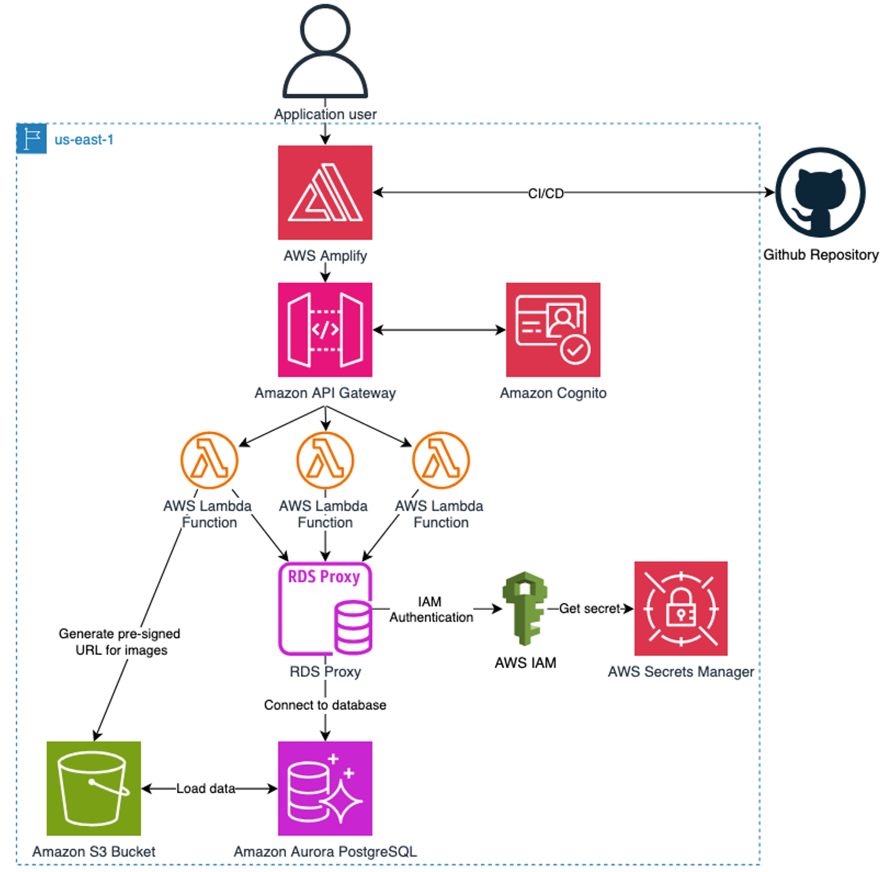

# Building Your First Serverless Web App with Amazon Aurora

📝 Imagine a dynamic rewards program where customers' loyalty transforms into delightful shopping experiences. In this hands-on project, we'll build a modern retail rewards system that turns earned points into treasures from a curated product catalog. Customers can seamlessly browse through an extensive collection of merchandise - from electronics and home goods to fashion accessories and exclusive items - all available for redemption using their loyalty points.

The Xanadu Rewards Application is a full-stack serverless application that demonstrates best practices for building modern web applications on AWS. The application allows users to browse products, manage a shopping cart, and redeem points for purchases.

## Topics

- [What You'll Build](#What-You'll-Build)
- [Application Demo](#Application-Demo)
- [Key Features of Xanadu Rewards Application](#key-features-of-xanadu-rewards-application)
- [Design Requirements](#design-requirements)
- [Architecture Overview](#architecture-overview)
- [Getting Started](#getting-started)
- [Reference Implementation](#reference-implementation)
- [Getting Started](#getting-started)

## What You'll Build
- A complete retail rewards points system
- Serverless web application using [Aurora PostgreSQL Serverless v2](https://docs.aws.amazon.com/AmazonRDS/latest/AuroraUserGuide/aurora-serverless-v2.html)
- Application deployment by [AWS CloudFormation](https://aws.amazon.com/cloudformation/) and [AWS Amplify](https://aws.amazon.com/amplify/)

> **💡 Quick Start Available**: Want to skip the manual setup to launch your first serverless application? Launch the infrastructure with [AWS CloudFormation deployment](https://console.aws.amazon.com/cloudformation/home/#stacks/create/template?stackName=XanaduRewardApp&templateSource=Upload) - download the [template file](../3_Building_Your_First_Serverless_Web_App_with_Aurora/rewards-app-example/cfn/cloudformation-rewards-app.yaml) first and upload it. Follow the [deployment instructions](./rewards-app-example/deployment-guide.ipynb) to quickly deploy the solution. 

## Application Demo 🎥 

## Key Features of Xanadu Rewards Application

Step into a world where your loyalty points become a gateway to endless shopping possibilities:

* **Seamless Shopping Experience**
  - Quick sign-up and login with your preferred method
  - Remember your preferences and shopping history
  - Pick up right where you left off on any device

* **Engaging Product Discovery**
  - Browse through beautiful product galleries
  - Find exactly what you want with smart search
  - Explore curated collections and special offers
  - View crystal-clear product images and detailed descriptions

* **Smart Points Management**
  - Watch your points balance update in real-time
  - Track every point earned and spent
  - See how far you are from your next reward
  - Receive notifications for special point-multiplier events

* **Convenient Cart Experience**
  - Add items while browsing
  - Adjust quantities with ease
  - See point totals update instantly
  - Save items for later

* **Smooth Checkout Process**
  - Complete your order in just a few clicks
  - Get instant confirmation
  - Track your orders easily
  - View your redemption history anytime

## Design Requirements

We've crafted every detail with your experience in mind:

* **Always Available, Always Fast**
  - Shop anytime, from anywhere
  - Pages load in a snap
  - No waiting during busy sales periods
  - Smooth browsing even on slower connections

* **Safe and Secure**
  - Shop with confidence knowing your information is protected
  - See your exact points balance before and after each transaction
  - Get notifications for account activity
  - Access your complete transaction history

* **Reliable and Trustworthy**
  - Every point is accurately tracked
  - Orders are processed instantly
  - Your shopping cart is always up to date
  - Customer support is just a click away

* **Smart and Efficient**
  - Find products quickly with intelligent search
  - Get personalized recommendations
  - Save your favorite items
  - Set alerts for when items become available

## Architecture Overview

The application uses the following AWS services:

- **Amazon Aurora PostgreSQL Serverless v2**: Scalable, serverless relational database
- **Amazon RDS Proxy**: Connection pooling for database access
- **AWS Lambda**: Serverless compute for backend logic
- **Amazon API Gateway**: RESTful API endpoints
- **Amazon Cognito**: User authentication and authorization
- **AWS Identity and Access Management (IAM)**: Fine-grained access control and permissions
- **AWS Amplify**: Frontend hosting and CI/CD
- **Amazon S3**: Storage for static assets and images
- **AWS Secrets Manager**: Secure storage of database credentials
- **AWS CloudFormation**: Infrastructure as code deployment

## Getting Started

This section is organized into the following subsections:

1. [**Design Your Serverless Architecture**](./3.1_Design_Your_Serverless_Architecture/README.MD): Learn about the architectural decisions and design patterns for serverless applications with Aurora.
2. [**Implementing the Backend**](./3.2_Implementing_the_Backend/README.MD): Explore how to implement the serverless backend using Lambda, API Gateway, and Aurora PostgreSQL Serverless v2.
3. [**Implementing the Frontend**](./3.3_Implementing_the_Frontend/README.MD): Learn how to build a React frontend with AWS Amplify that interacts with your serverless backend.
4. [**Deployment and Operations**](./3.4_Deployment_and_Operations/README.MD): Understand how to deploy, monitor, and operate your serverless application in production.

For a complete deployment walkthrough, refer to the [deployment guide](./rewards-app-example/deployment-guide.ipynb).

## Reference Implementation

A complete reference implementation is available in the [rewards-app-example](./rewards-app-example) directory. This implementation includes:

- CloudFormation templates for infrastructure deployment
- Lambda functions for backend logic
- React application for the frontend
- Comprehensive deployment guide

## Next Steps

🎉 **Ready to dive in?** Let's start your hands-on journey with [3.1 Design Your Serverless Architecture](./3.1_Design_Your_Serverless_Architecture) and begin building your Aurora expertise!

> 💡 **Note**: Want to master serverless patterns? The [Serverless Web Applications Workshop](https://webapp.serverlessworkshops.io/) guides you through building complete serverless applications. You\'ll learn proven architectural patterns, cost optimization techniques, and deployment strategies used by successful startups and enterprises.

## Learn More

- [Serverless Application Lens - Well-Architected guidance for serverless workloads](https://docs.aws.amazon.com/wellarchitected/latest/serverless-applications-lens/)
- [Aurora Serverless v2 Workshop - Build auto-scaling serverless database applications](https://catalog.workshops.aws/aurora-serverless-v2/en-US)
- [Serverless Web Applications Workshop - End-to-end serverless application development](https://webapp.serverlessworkshops.io/)
- [Aurora Serverless v2 Guide - Automatic scaling database for variable workloads](https://docs.aws.amazon.com/AmazonRDS/latest/AuroraUserGuide/aurora-serverless-v2.html)
