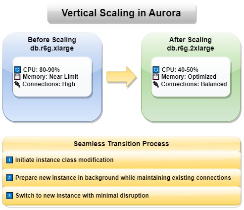
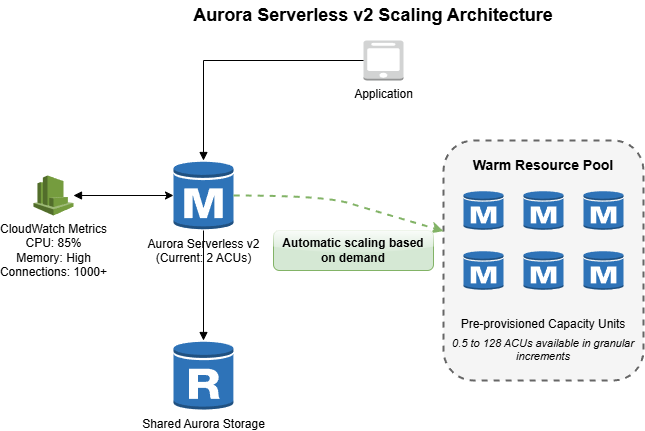

# Detailed Aurora Scaling Options

Based on your requirements from the scaling decision flowchart, this document provides in-depth information about your selected Aurora scaling approach. Each section contains technical details, implementation considerations, and reference links to help you successfully implement the scaling strategy that best fits your workload characteristics. Navigate directly to your chosen scaling option for specific implementation guidance, or explore other approaches to understand the full spectrum of Aurora's scaling capabilities.

### Vertical Scaling

**Modify DB Instance Class on Demand**

When your current instance class struggles to handle the workload, you can modify it to a larger instance class. For example, if you notice high CPU utilization or memory constraints, you might upgrade from a db.r6g.xlarge to a db.r6g.2xlarge instance to accommodate increased demands.

**Seamless Transition Between Instance Types**

Aurora manages the transition between instance types with minimal impact on your applications. During the modification, Aurora maintains existing connections while preparing the new instance in the background. This process ensures your applications continue to operate during the transition.

- [Managing Aurora PostgreSQL](https://docs.aws.amazon.com/AmazonRDS/latest/AuroraUserGuide/AuroraPostgreSQL.Managing.html)

### Global Database Features

**Cross-Region Replication**

Aurora Global Database enables worldwide distribution of your database with typical replication latencies under one second. This capability allows you to:
- Serve users from the nearest region
- Implement disaster recovery across regions
- Maintain compliance with data locality requirements
- Support global applications efficiently

- [Building Resilient Multi-Region Applications with Aurora Global Database](https://aws.amazon.com/blogs/database/use-amazon-aurora-global-database-to-build-resilient-multi-region-applications/)

### Aurora Serverless v2 Architecture

#### Dynamic Capacity Adjustment

Aurora Serverless v2 provides fine-grained scaling from 0 to 128 ACUs (Aurora Capacity Units). The system continuously monitors workload metrics and adjusts capacity in real-time. For example, during peak hours, your database might scale up to handle increased traffic, then scale down during quiet periods to optimize costs.

#### Rapid Response to Workload Changes

The scaling mechanism responds to changing demands within seconds. When it detects increased workload:

- Capacity is adjusted immediately
- Additional resources are allocated
- Performance is maintained
- Costs are optimized automatically

- [Scaling to Zero Capacity with Aurora Serverless v2](https://aws.amazon.com/blogs/database/introducing-scaling-to-0-capacity-with-amazon-aurora-serverless-v2/)

### Aurora Limitless Database

**Transparent Sharding Architecture**

Aurora Limitless Database represents a breakthrough in database scaling by automatically managing data distribution across multiple Aurora clusters. When your database grows beyond single-instance capacity limits, Limitless Database transparently shards your data while maintaining consistent application access.

**Intelligent Data Distribution**

The system automatically handles data distribution without requiring application modifications. When you insert or query data, Aurora Limitless Database:
- Determines optimal shard placement
- Routes requests efficiently
- Maintains data consistency
- Handles cross-shard queries

- [Aurora Limitless](https://aws.amazon.com/blogs/aws/amazon-aurora-postgresql-limitless-database-is-now-generally-available/)

### Aurora DSQL

Amazon Aurora DSQL is a serverless, distributed relational database built for highly available, transactional workloads. It delivers virtually unlimited scale with no infrastructure management, making it ideal for microservices, serverless, and event-driven architectures.

**Key Benefits:**
- **PostgreSQL-compatible** – Use familiar tools and SQL features
- **Always-on availability** – 99.99% (single-Region) and 99.999% (multi-Region) uptime with active-active architecture
- **Fully managed** – No provisioning, patching, or manual scaling
- **Automatic scaling** – Compute, I/O, and storage adjust to workload demands
- **Built-in resilience** – Handles failures without downtime or data loss

- [Introducing Amazon Aurora DSQL](https://aws.amazon.com/blogs/database/introducing-amazon-aurora-dsql)

## Next Steps

After understanding Aurora's scalability features, consider these next steps:

1. **Evaluate Your Workload Patterns** - Analyze your application's read/write patterns and traffic variability
2. **Choose the Right Scaling Strategy** - Select from vertical scaling, read replicas, or serverless options
3. **Implement Monitoring** - Set up CloudWatch metrics to track database performance and scaling events
4. **Test Scaling Scenarios** - Simulate peak loads to verify your scaling configuration works as expected
5. **Explore Advanced Features** - Consider Aurora Global Database for multi-region deployments or Aurora Limitless for extreme scale

Let's implement read replicas for auto-scaling for reads [5.2_Implementing_Read_Replicas](../5.2_Implementing_Read_Replicas/README.md).

## Learn More

- [Aurora Serverless](https://docs.aws.amazon.com/AmazonRDS/latest/AuroraUserGuide/aurora-serverless-v2.html)
- [Amazon Aurora Global Database](https://docs.aws.amazon.com/AmazonRDS/latest/AuroraUserGuide/aurora-global-database.html)
- [Aurora Limitless](https://docs.aws.amazon.com/AmazonRDS/latest/AuroraUserGuide/limitless.html)
- [Best Practices for Amazon Aurora](https://docs.aws.amazon.com/AmazonRDS/latest/AuroraUserGuide/Aurora.BestPractices.html)
- [Amazon Aurora DSQL](https://docs.aws.amazon.com/aurora-dsql/latest/userguide/what-is-aurora-dsql.html)
- [Monitor Amazon Aurora](https://docs.aws.amazon.com/AmazonRDS/latest/AuroraUserGuide/USER_PerfInsights.html)
- [AWS Database Blog - Aurora Articles](https://aws.amazon.com/blogs/database/category/database/amazon-aurora/)