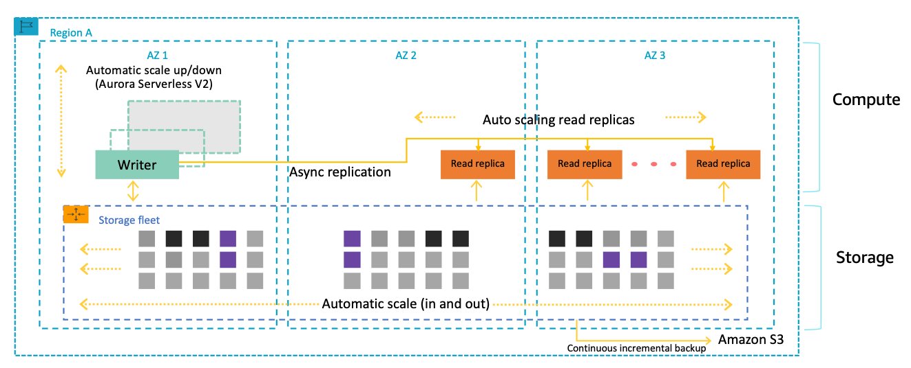
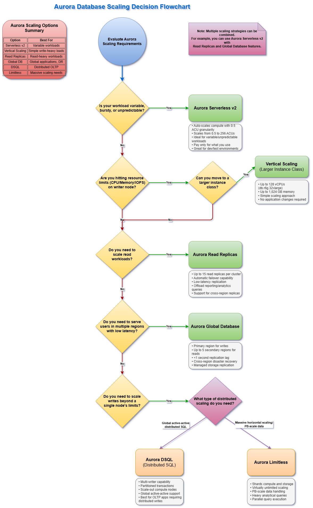

# Understanding Aurora Scalability Features

In today's data-driven world, your database infrastructure must handle unpredictable workloads, rapid growth, and global distribution demands without compromising performance or breaking your budget. Amazon Aurora's comprehensive scaling capabilities provide the foundation for a database strategy that can evolve alongside your business needs—from early-stage startups to global enterprises.

> 💡 **Note**: Building a global application? The [Aurora Global Database Workshop](https://catalog.workshops.aws/aurora-global-database/en-US) shows you how to achieve sub-second cross-region replication. You\'ll learn to build applications that serve users worldwide with local performance and automatic disaster recovery.

## Topics

- [Why Scaling Matters](#why-scaling-matters)
- [Aurora's Scaling Universe](#aurora's-scaling-universe)
- [Aurora's Scaling Decision Flowchart](#aurora's-scaling-decision-flowchart)

## Why Scaling Matters

**The cost of inadequate scaling is substantial:**

- Customer experience degradation during traffic spikes
- Missed business opportunities when systems can't handle growth
- Unnecessary infrastructure expenses from over-provisioning
- Development delays waiting for database operations

Aurora offers a unique blend of scaling approaches that address these challenges through automated, on-demand, and predictive scaling mechanisms tailored to your specific workload patterns.

## Aurora's Scaling Universe

Aurora provides multiple scaling dimensions that can be combined to create the optimal infrastructure for your use case:

- **Compute Scaling**: From serverless automatic scaling to precise provisioning
- **Read Performance**: Distribute read workloads across multiple replicas
- **Storage Scaling**: Automatic storage expansion without performance impact
- **Global Distribution**: Multi-region deployment with minimal replication lag
- **Revolutionary Architectures**: New paradigms with Aurora Limitless Database and DSQL

## Aurora's Scaling Decision Flowchart
Use the flowchart below as a reference point to determine your primary reason for scaling. Once you've identified your scaling needs, navigate to [Aurora Scaling Details](./Aurora_Scaling_Details.md) for in-depth information about your chosen approach. Then proceed to [Implementing Vertical and Horizontal Scaling](../5.3_Vertical_and_Horizontal_Scaling_Strategies/5.3.1_Implementing_Vertical_and_Horizontal_Scaling_Strategies.ipynb) for code examples and implementation guidance.

## Next Steps

🎉 **Impressive!** You've learned to scale Aurora horizontally and vertically, handling massive workloads with confidence. Your scaling expertise is remarkable!

**Ready to continue?** Let's advance to [5.2 Implementing Read Replicas](../5.2_Implementing_Read_Replicas) and boost your database's read performance with Aurora's powerful replication features!

## Learn More

- [Aurora Global Database Workshop - Build globally distributed database applications](https://catalog.workshops.aws/apgimmday/en-US/high-availability-and-durability/aurora-global-db)
- [Aurora Limitless Database - Horizontal scaling beyond traditional Aurora limits](https://docs.aws.amazon.com/AmazonRDS/latest/AuroraUserGuide/limitless.html)
- [Aurora Auto Scaling - Automatically adjust capacity based on application demand](https://docs.aws.amazon.com/AmazonRDS/latest/AuroraUserGuide/Aurora.Integrating.AutoScaling.html)
- [Database Migration Workshop - Migrate existing databases to Aurora with minimal downtime](https://immersionday.com/dms)
