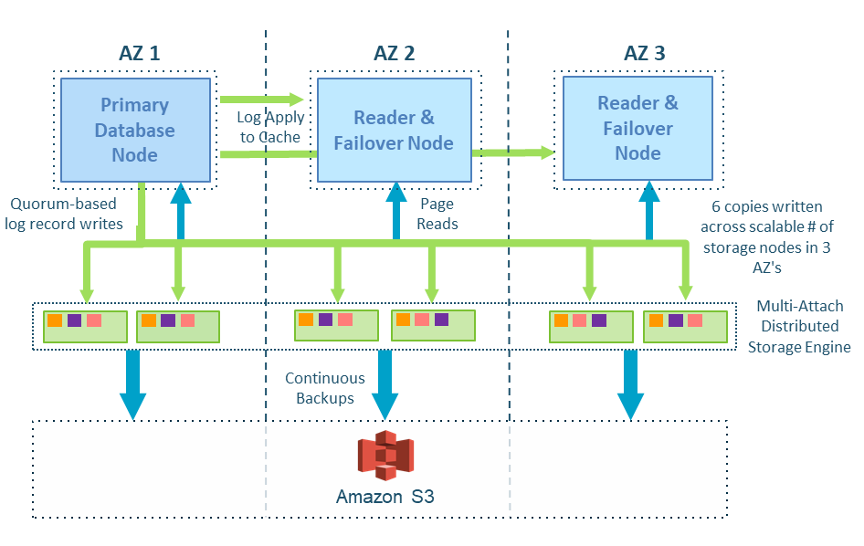

# Amazon Aurora Read Replicas: Scaling Your Database for Performance

## What Are Read Replicas?

Read replicas are additional database instances that maintain synchronized copies of your primary database. In Amazon Aurora, these replicas leverage Aurora's shared storage architecture to provide efficient read scaling without impacting write performance on the primary instance.

## Topics

- [What Are Read Replicas?](#what-are-read-replicas?)
- [Key Benefits](#key-benefits)
- [When to Use Read Replicas](#when-to-use-read-replicas)
- [Auto Scaling with Read Replicas](#auto-scaling-with-read-replicas)
- [Best Practices](#best-practices)
- [Hands-On Example](#hands-on-example)

## Key Benefits

- **Improved Read Performance**: Distribute read traffic across multiple instances
- **Scalability**: Support for up to 15 read replicas per Aurora cluster
- **High Availability**: Automatic failover capabilities when configured as part of Multi-AZ deployments
- **Low Latency**: Minimal replication lag (typically milliseconds) due to Aurora's storage architecture
- **Cost Efficiency**: Pay only for the additional compute capacity, not duplicate storage

## When to Use Read Replicas

| Read-Heavy Workloads | Reporting and Business Intelligence | Global Applications |
|----------------------|------------------------------------|--------------------|
| Ideal for applications where read operations significantly outnumber writes:  • E-commerce product catalogs and search • Content management systems • Media streaming platforms • Analytics applications | Offload resource-intensive reporting queries:  • Financial reporting systems • Business intelligence dashboards • Data warehousing operations • Log analysis | Support users across different geographic regions:  • Reduce latency with regional read replicas • Comply with data sovereignty requirements • Improve disaster recovery capabilities |

## Auto Scaling with Read Replicas

Aurora can automatically adjust the number of read replicas based on workload:

- **Metric-Based Scaling**: Add or remove replicas based on CPU utilization, connections, or queue depth
- **Target Tracking**: Set a target value (e.g., 70% CPU) and let Aurora maintain that level
- **Scheduled Scaling**: Increase capacity during known peak periods
- **Seamless Connection Management**: Reader endpoint automatically distributes connections

## Best Practices

- Use connection pooling to efficiently distribute queries
- Configure appropriate scaling thresholds based on workload patterns
- Monitor replication lag to ensure data consistency
- Implement retry logic in applications for replica failover scenarios
- Consider cross-region replicas for global applications

## Hands-On Example

Ready to see read replicas in action? Our [hands-on scaling example](./read-replica-scaling-example.ipynb) demonstrates:

1. Setting up read replicas with auto scaling
2. Generating test workloads to trigger scaling events
3. Monitoring performance metrics during scaling
4. Analyzing the impact on response times and throughput

## Next Steps

🎉 **Impressive!** You've learned to scale Aurora horizontally and vertically, handling massive workloads with confidence. Your scaling expertise is remarkable!

**Ready to continue?** Let's advance to [5.3 Vertical and Horizontal Scaling Strategies](../5.3_Vertical_and_Horizontal_Scaling_Strategies) and discover powerful techniques to expand your Aurora database's capacity and performance!

> 💡 **Note**: Hit Aurora\'s scaling limits? [Aurora Limitless Database](https://docs.aws.amazon.com/AmazonRDS/latest/AuroraUserGuide/limitless.html) breaks through traditional boundaries with automatic horizontal scaling. You can now handle millions of transactions per second across multiple writer instances while maintaining ACID compliance.

## Learn More

- [Aurora Global Database Workshop - Build globally distributed database applications](https://catalog.workshops.aws/apgimmday/en-US/high-availability-and-durability/aurora-global-db)
- [Aurora Limitless Database - Horizontal scaling beyond traditional Aurora limits](https://docs.aws.amazon.com/AmazonRDS/latest/AuroraUserGuide/limitless.html)
- [Aurora Auto Scaling - Automatically adjust capacity based on application demand](https://docs.aws.amazon.com/AmazonRDS/latest/AuroraUserGuide/Aurora.Integrating.AutoScaling.html)
- [Database Migration Workshop - Migrate existing databases to Aurora with minimal downtime](https://immersionday.com/dms)
