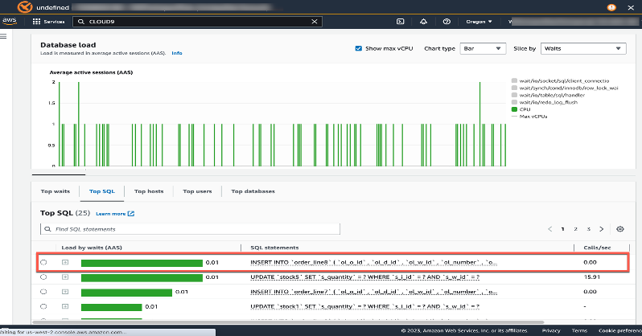

# 6.2 Query Optimization techniques

Efficient query execution is critical to maintaining the performance and cost-effectiveness of Amazon Aurora clusters. Poorly written queries can lead to excessive CPU usage, increased I/O operations, and slower application performance—ultimately driving up costs. Aurora, being MySQL- and PostgreSQL-compatible, supports a wide range of query tuning strategies to help you optimize workload performance. By leveraging indexing strategies, analyzing query plans, minimizing full table scans, and offloading read workloads to replicas, you can significantly reduce response times and resource consumption. 

This section outlines practical techniques to identify bottlenecks, streamline query execution, and make the most of Aurora’s performance features like the query plan management and Performance Insights.

## Topics

- [Aurora Architectural Improvements](#aurora-architectural-improvements)
- [Performance Insights](#performance-insights)
- [Query Plan Management](#query-plan-management)
- [Next Steps](#next-steps)
- [Learn More](#learn-more)

## Aurora Architectural Improvements
Amazon Aurora introduces several architectural enhancements that significantly boost application performance compared to traditional database engines. One of the key improvements is the reduction in I/O operations—Aurora avoids the overhead of buffered writes by sending changes directly to a distributed, highly durable storage layer. This results in faster commit operations and reduced latency. Additionally, Aurora employs an advanced caching mechanism that minimizes disk access by efficiently reusing memory for frequently accessed data. The underlying infrastructure is backed by high-performance SSDs, which contribute to exceptional read/write throughput and responsiveness. As we progress through this guide, you’ll discover how these built-in architectural advantages, combined with Aurora’s intelligent scaling and optimization features, provide a powerful foundation for high-performance, cost-efficient applications.
### [Aurora Architecture Improvements](https://gitlab.aws.dev/sup-yall/namer/db-cookbook/-/tree/main/2_Your_First_Database_on_AWS?ref_type=heads)

## Performance Insights
Amazon Aurora Performance Insights is a powerful monitoring tool that helps you visualize and analyze database performance over time. It provides a rich, time-based interface to identify bottlenecks by highlighting the top SQL queries, wait events, database load, and user activity contributing to performance degradation. 

By enabling Performance Insights, you gain access to a continuously sampled and aggregated view of your workload, which can be filtered by dimensions such as SQL ID, wait state, or application. This makes it easier to pinpoint inefficient queries, understand peak load times, and make informed decisions about indexing, query rewriting, or scaling. Performance Insights supports integration with Amazon CloudWatch and can retain historical data for up to two years (with extended retention), making it an invaluable tool for both real-time diagnostics and long-term trend analysis.
 

###  [Performance Optimization](https://gitlab.aws.dev/sup-yall/namer/db-cookbook/-/blob/main/4_Operational_Excellence_Best_Practices_for_Aurora/4.4_Performance_Optimization_Tools/performance_optimization.ipynb?ref_type=heads)

# Query Plan Management
Amazon Aurora (specifically with PostgreSQL compatibility) supports Query Plan Management, a feature designed to ensure query performance consistency by stabilizing execution plans. This mechanism introduces a persistent representation of query plans—called plan outlines—which are used to govern how queries are executed over time. When a SQL statement is executed two or more times, the query planner selects the minimum cost execution plan as usual. If this is the first plan encountered, it is recorded as an Approved Plan. Any subsequent plans that differ are saved as Unapproved Plans. During re-planning, Aurora prioritizes using the lowest-cost Approved Plan. If none of the approved plans are viable, the engine reverts to the optimizer’s default plan. New plans are evaluated offline before promotion, allowing DBAs to validate performance improvements without introducing risk to production workloads. This feature is especially valuable for production environments where stability and predictability of performance are paramount.

**Enable plan management**
	Set rds.enable_plan_management to one in your cluster parameter group

**Query plan management is primarily controlled by two parameters**
	apg_plan_mgmt.capture_plan_baselines = { manual, automatic, off }

## Next Steps

🎉 **Excellent!** You've implemented monitoring, alerting, and performance optimization strategies. Your operational excellence skills are top-notch!

**Ready to continue?** Let's advance to [6.3 Optimizing Cost Efficiency](../6.3_Optimizing_Cost_Efficiency) and learn strategies to maximize your Aurora investment while minimizing costs!

> 💡 **Note**: Want to slash your database costs? [Aurora I/O-Optimized](https://docs.aws.amazon.com/AmazonRDS/latest/AuroraUserGuide/Aurora.Overview.StorageReliability.html#aurora-storage-type) can reduce costs by up to 40% for I/O-intensive workloads. You pay a predictable price for compute and storage, eliminating surprise I/O charges that can spike your bill.

## Learn More

- [Hands-on Lab: Troubleshoot Amazon Aurora PostgreSQL Performance by Use Case](https://catalog.workshops.aws/apg-perf-troubleshooting/en-US)
- [Aurora Cost Optimization Guide - Strategies for optimizing database costs and performance](https://docs.aws.amazon.com/AmazonRDS/latest/AuroraUserGuide/Aurora.Managing.Performance.html)
- [AWS Cost Optimization Workshop - Reduce costs while maintaining performance](https://catalog.workshops.aws/well-architected-cost-optimization/en-US)
- [Aurora I/O-Optimized - New storage configuration for I/O-intensive workloads](https://docs.aws.amazon.com/AmazonRDS/latest/AuroraUserGuide/Aurora.Overview.StorageReliability.html#aurora-storage-type)
- [RDS Reserved Instances - Save up to 75% with 1 or 3-year capacity reservations](https://docs.aws.amazon.com/AmazonRDS/latest/UserGuide/USER_WorkingWithReservedDBInstances.html)
