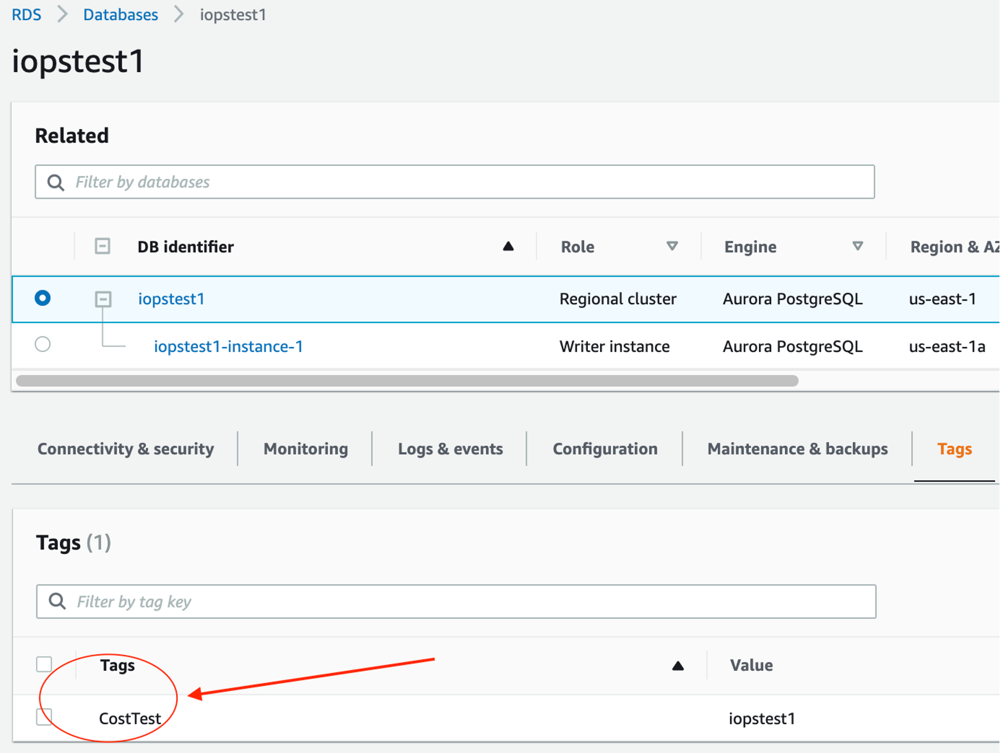
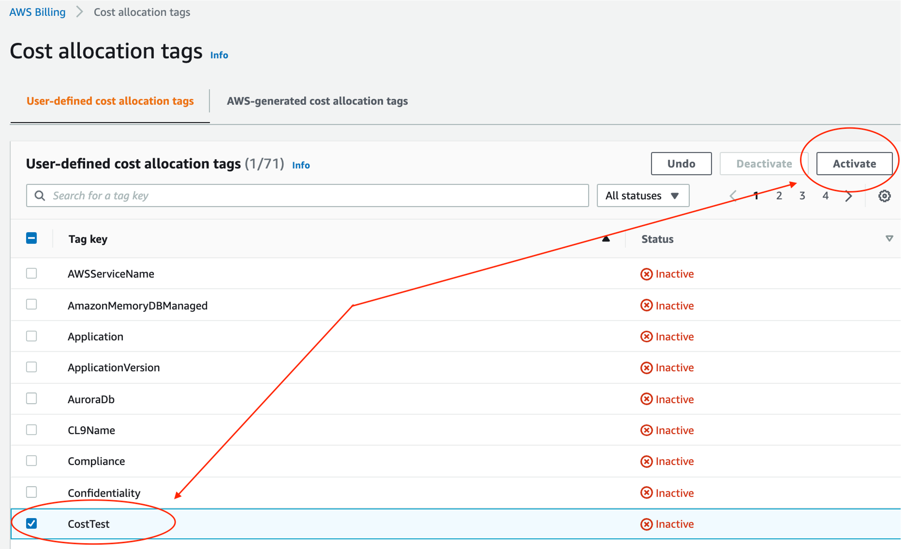
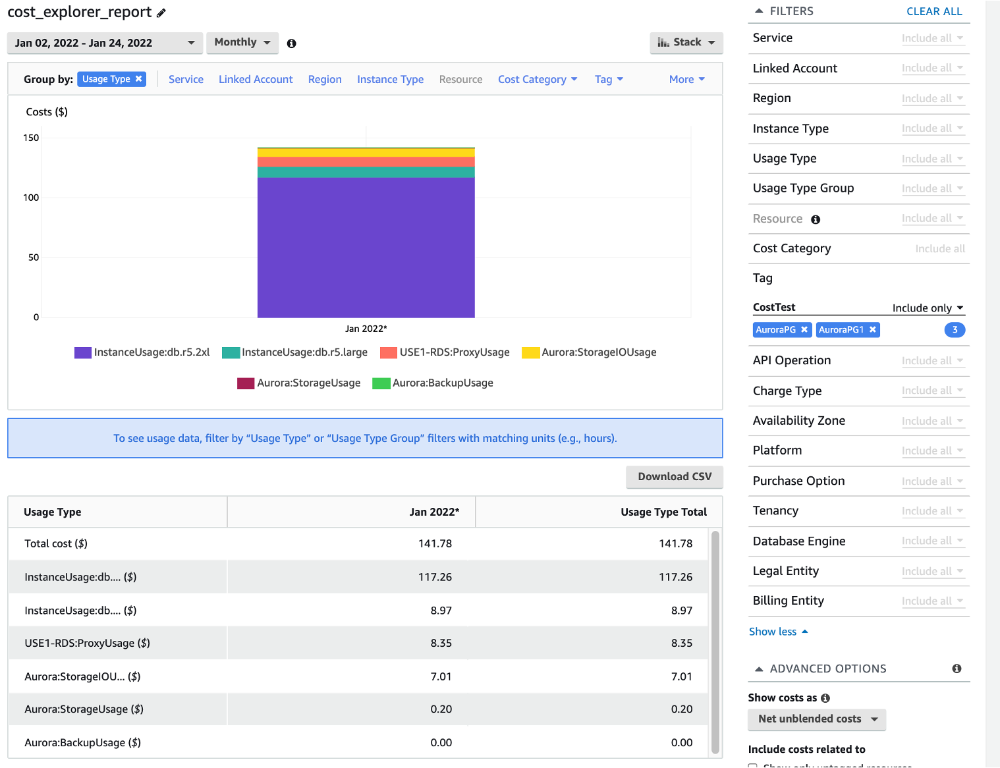
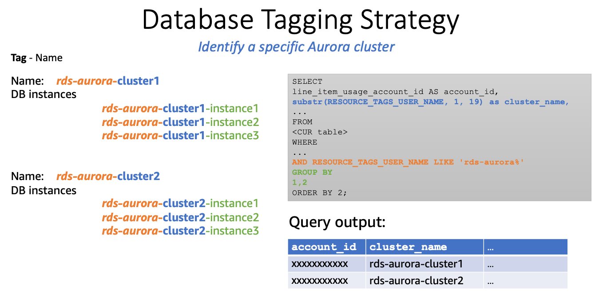
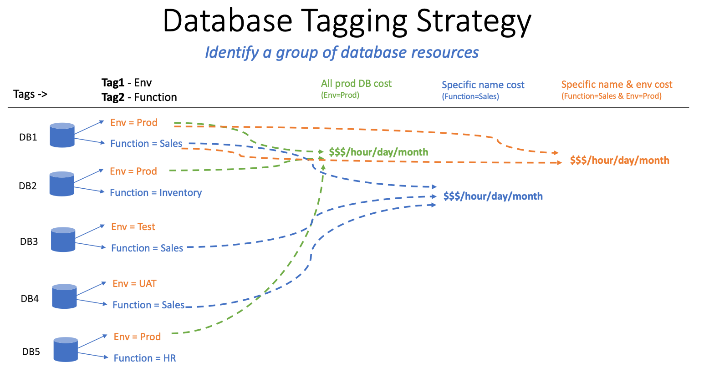

# 6.3 Optimizing Cost Efficiency

## Topics

- [3.a Compute Optimization Strategies](#3.a-compute-optimization-strategies)
- [3b. Storage Optimization](#3b.-storage-optimization)
- [3c. I/O Cost Control](#3c.-i/o-cost-control)
- [3d. Backups and Snapshots](#3d.-backups-and-snapshots)
- [3e. Data Transfer Costs](#3e.-data-transfer-costs)
- [3f. Advanced Aurora Features for Optimization](#3f.-advanced-aurora-features-for-optimization)
- [3g. Visibility & Monitoring](#3g.-visibility-&-monitoring)
- [Optimization Summary](#optimization-summary)

## 3.a Compute Optimization Strategies
Provisioning DB instances has a direct impact on both performance and cost. Over-provisioning leads to wasted spend, while under-provisioning affects performance. Let’s see some of the optimizing strategies for compute that you can consider based on your need. In the image, read replicas are scaled horizontally and eventually increase the overall number of cluster’s compute.
 
 | Optimization Technique | Solution |
|:---|:---|
| Consider using Reserved Instances | [Reserved DB instances provide you with a significant discount compared to on-demand DB instance pricing](https://docs.aws.amazon.com/AmazonRDS/latest/AuroraUserGuide/USER_WorkingWithReservedDBInstances.html) |
| Explore Graviton2 instances | [AWS offers Graviton3 (R7g) and Graviton4 (R8g) instances for Aurora, providing further performance and price-performance enhancements](https://aws.amazon.com/about-aws/whats-new/2024/09/amazon-aurora-r7g-graviton3-based-instance-family-additional-regions/) |
| Leverage CW and Trusted advisor Data points to scale down | [CW provides real-time metrics, while Trusted Advisor offers recommendations for cost optimization](https://aws.amazon.com/premiumsupport/technology/trusted-advisor/) |
| Leverage Aurora Serverless, an on-demand, autoscaling configuration that automatically adjusts capacity based on application needs | [For Bursty workloads, Amazon Aurora Serverless v2 allows for scaling down to zero ACUs during periods of inactivity, further optimizing costs](https://aws.amazon.com/blogs/database/introducing-scaling-to-0-capacity-with-amazon-aurora-serverless-v2/) |
| Tune resource intensive queries | [Improving query performance for Aurora PostgreSQL with Aurora Optimized Reads](https://docs.aws.amazon.com/AmazonRDS/latest/AuroraUserGuide/AuroraPostgreSQL.optimized.reads.html#AuroraPostgreSQL.optimized.reads.monitoring) |
| Consider using read replicas | [Amazon Aurora Auto Scaling with Aurora Replicas](https://docs.aws.amazon.com/AmazonRDS/latest/AuroraUserGuide/Aurora.Integrating.AutoScaling.html) |
| Schedule stop/start of Aurora instances | [For Provisioned Aurora Clusters, schedule start and stop using Lambda](https://repost.aws/questions/QUOijEz3TVRCaRsBqcdXJIRg/aws-lambda-function-to-start-stop-aurora-cluster) |
| Reduce compute cost using headless clusters | [Using headless clusters in Amazon Aurora Global Database and fast clones can significantly reduce compute costs](https://docs.aws.amazon.com/en_us/AmazonRDS/latest/AuroraUserGuide/aurora-global-database-attach.console.headless.html) |

**Best Practices:**
- Separate write and read workloads.
- Use appropriate DB instance types for workload needs.
- Monitor idle instances using AWS Trusted Advisor.

Troubleshooting FAQ:
- Why aren’t my replicas scaling automatically? → Check CloudWatch metric thresholds & cooldown timers.

## 3b. Storage Optimization
Aurora uses automatically scaling storage, so it's crucial to manage data growth effectively.
Optimization Recommendations:
- Monitor VolumeBytesUsed with CloudWatch.
- Delete unused objects (tables/indexes).
- Use partitioning for large tables and drop partitions instead of mass deletes.
 
**Best Practices:**
- Enable lifecycle policies for snapshot cleanup.
- Use data archival patterns for cold data.

## 3c. I/O Cost Control
I/O costs are driven by actual read/write operations. There's no charge for reads from the buffer cache.
 
Optimization Recommendations:
- Avoid full table scans with proper indexing.
- Batch writes to reduce IOPS.
- Use covering indexes and native snapshots.
- Remove unused and duplicate indexes.

Cost Insight Tip: Logical backups (pg_dump) can spike read I/O—prefer native snapshots for backups.
**Best Practices:**
- Use metrics like ReadIOPS, WriteIOPS to analyze patterns.
- Implement caching strategies (e.g., ElastiCache) where feasible.

## 3d. Backups and Snapshots
Backup storage grows with time. Retention policies impact costs significantly.
Optimization Recommendations:
- Set appropriate retention periods.
- Regularly review and delete manual snapshots.
**Best Practices:**
- Automate snapshot cleanup.
- Export snapshots to S3 for long-term archival if needed.

## 3e. Data Transfer Costs
Cross-AZ and cross-region data traffic adds to your Aurora bill.
Optimization Recommendations:
- Minimize cross-AZ traffic by locating clients in the same AZ.
- Use VPC endpoints to access other AWS services cost-effectively.
**Best Practices:**
- Plan application placement to optimize for locality.
- Consider consolidating clients or using regional endpoints.

## 3f. Advanced Aurora Features for Optimization
Feature Optimization Benefit
- Aurora Global Database: Offload read operations to regional replicas
- RDS Proxy: Reduces connection churn, improves scalability
- Snapshot Export to S3: Export to S3 for cost-effective analytics and archiving
- Fast Cloning: Quick duplication of environments without full copy cost
- Database Activity Streams: Real-time activity insights via Kinesis for advanced observability

## 3g. Visibility & Monitoring
Use these tools for visibility into cost and performance patterns:
- Cost Allocation Tags – Organize billing by environment, project, or team.
- Cost Explorer – Drill into usage by cluster, region, or usage type.
- CloudWatch Alarms – Proactively monitor metrics like CPU, memory, and storage.

You can use tags to organize your database resources, and [AWS cost allocation tags](https://docs.aws.amazon.com/awsaccountbilling/latest/aboutv2/cost-alloc-tags.html) to track your AWS costs on a detailed level. AWS cost allocation tags allow you to categorize and analyze your AWS spending based on different dimensions like department, application, or environment, providing more granular insights into your cost distribution. For example, you can use the **Name** tag as the following example to uniquely identify the cost associated with a Amazon Aurora cluster. 

You can use tags **Env**, and **Function** to analyze and track the usage of the databases from a particular environment and function.

**Best Practices:**
- Always enable and activate Cost Tags.
- Create dashboards combining CloudWatch, Trusted Advisor, and Cost Explorer data.

## Optimization Summary

| Area | Recommendations |
|:---:|:---:|
| Compute | Use RIs, Graviton, Serverless, scale with replicas, auto-stop dev/test clusters |
| Storage | Delete unused objects, use partitions, monitor usage |
| I/O | Tune queries, batch writes, avoid full scans |
| Backups | Review retention, remove old manual snapshots |
| Transfer | Align client location with DB, use VPC endpoints |
| Slow failover | Investigate DNS TTL, connection draining, and reader promotion time |
| Aurora Serverless v2 not scaling down | Check connection count and minACU configuration |

## Next Steps

🎉 **Excellent!** You've implemented monitoring, alerting, and performance optimization strategies. Your operational excellence skills are top-notch!

**Ready for the next challenge?** Continue with [7. Break Free from Everything in One Database Trap: A Journey to Purpose-Built AWS Databases](../../7_Break_Free_from_Everything_in_One_Database_Trap_A_Journey_to_Purpose_Built_AWS_Databases/README.md) and discover how to leverage specialized database solutions for optimal performance and scalability across your entire application stack!

## Learn More

- [AWS Cost Optimization Workshop - Reduce costs while maintaining performance](https://catalog.workshops.aws/well-architected-cost-optimization/en-US)
- [Aurora I/O-Optimized - New storage configuration for I/O-intensive workloads](https://docs.aws.amazon.com/AmazonRDS/latest/AuroraUserGuide/Aurora.Overview.StorageReliability.html#aurora-storage-type)
- [RDS Reserved Instances - Save up to 75% with 1 or 3-year capacity reservations](https://docs.aws.amazon.com/AmazonRDS/latest/UserGuide/USER_WorkingWithReservedDBInstances.html)
- [Aurora Cost Optimization Guide - Strategies for optimizing database costs and performance](https://docs.aws.amazon.com/AmazonRDS/latest/AuroraUserGuide/Aurora.Managing.Performance.html)
