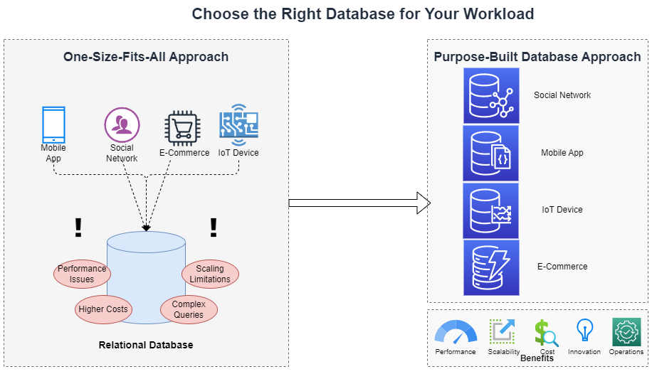
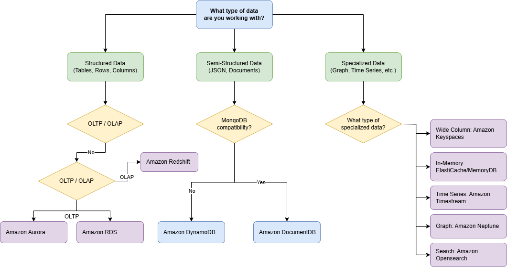

# Purpose-Built Databases: Choosing the Right Tool for Your Data Workload

> 💡 **Note**: Confused about which database to choose? The [Purpose-Built Databases Workshop](https://aws.amazon.com/products/databases/learn/) provides a decision framework used by AWS architects. You\'ll learn to match workload characteristics to optimal database engines, avoiding costly architectural mistakes.

## 📌 Introduction

In today's data-driven landscape, selecting the appropriate database technology has become a critical architectural decision that directly impacts application performance, scalability, and operational costs. The era of "one-size-fits-all" database solutions is giving way to purpose-built databases designed to excel at specific workloads and data patterns. As applications evolve to handle diverse data types, complex query requirements, and global scale, organizations are increasingly recognizing that different components of their systems may benefit from different database technologies. AWS offers a comprehensive portfolio of purpose-built database services, each optimized for specific use cases—from traditional relational workloads to document, key-value, graph, time-series, and in-memory databases. By understanding your application's unique data characteristics, access patterns, and performance requirements, you can select the database service that provides the optimal balance of functionality, performance, and cost-efficiency for your specific needs.

Many organizations begin with general-purpose relational databases. However, as applications grow in complexity and scale, they encounter issues like:

- ⚠️ **Performance bottlenecks** with non-relational data patterns
- 💰 **Increased operational costs** from overprovisioning to compensate for inefficiencies
- 🐢 **Development slowdowns** from working against the database's natural strengths
- 📊 **Analytics limitations** when dealing with specialized data types

## Topics

- [📌 Introduction](#📌-introduction)
- [🎯 Why Choose a Purpose-Built Database?](#🎯-why-choose-a-purpose-built-database?)
- [🧩 Key Considerations for Choosing](#🧩-key-considerations-for-choosing)
- [🗄️ Database Types and Services on AWS](#🗄️-database-types-and-services-on-aws)
- [🔍 How to Decide?](#🔍-how-to-decide?)
- [Select Database for your use case](#select-database-for-your-use-case)

## 🎯 Why Choose a Purpose-Built Database?

Different applications have different access patterns, query requirements, and scalability needs. Moving beyond the one-size-fits-all approach opens numerous advantages for your architecture:

- **Optimized experiences**: Purpose-built databases provide specialized functionality for specific needs like key-value, document, graph, in-memory, ledger, time series, and more.
- **Improved performance**: Using engines optimized for specific data types dramatically increases query efficiency and response times.
- **Enhanced scalability**: Purpose-built databases scale more effectively with your growing data requirements and varying access patterns.
- **Cost reduction**: More efficient resource utilization means you pay only for what you need, avoiding overprovisioning.
- **Faster innovation**: Better alignment with application needs allows development teams to build features more naturally.
- **Reduced operational overhead**: AWS managed services handle the heavy lifting of database administration, backups, and maintenance.

## 🧩 Key Considerations for Choosing
When selecting a purpose-built database, assess:

- **Data Model**: Structured, semi-structured, graph, key-value, etc.
- **Access Pattern**: OLTP vs OLAP, simple vs complex queries.
- **Scale Requirements**: Read-heavy, write-heavy, global scale.
- **Latency and Performance**: Real-time, in-memory needs.
- **Consistency and Durability**: Transactional (ACID) vs Eventual Consistency.
- **Cost Optimization**: Storage and compute patterns.
- **Integration and Ecosystem**: Compatibility with other AWS services.

## 🗄️ Database Types and Services on AWS

| Database Type | AWS Service | When to Choose | Best For |
|--------------|-------------|----------------|-----------|
| Relational | Amazon RDS, Aurora | Need relational data and complex joins | Traditional SQL apps, complex transactions, OLTP workloads |
| Key-Value | Amazon DynamoDB | Need high concurrency and low latency | High-throughput apps, serverless applications, gaming leaderboards |
| Wide Column | Amazon Keyspaces | Need Cassandra compatibility with managed service | High-scale applications, time-series data, industrial IoT |
| Document | Amazon DocumentDB | Need flexible schema with JSON | Content management, catalogs, user profiles |
| In-Memory | Amazon ElastiCache | Need caching layer for fast access | Real-time caching, session management, gaming leaderboards |
| Graph | Amazon Neptune | Need graph relationships | Social networks, recommendation engines, fraud detection |
| Time Series | Amazon Timestream | Need time-series data management | IoT applications, DevOps monitoring, industrial telemetry |
| Search | Amazon OpenSearch | Need fast search across documents | Full-text search, log analytics, real-time application monitoring |
| Data Warehouse | Amazon Redshift | Need to analyze petabytes of data | Business intelligence, big data analytics, data warehousing |

## 🔍 How to Decide?

1. **Start with Application Needs**: Understand access patterns and workloads.
2. **Analyze Current Pain Points**: Scaling issues, cost, performance, etc.
3. **Map Requirements to Database Types**: Refer to the table above.
4. **Evaluate Managed Services**: Prefer fully managed where possible.
5. **Plan for Future Growth**: Choose services that can evolve with your application.

## Select Database for your use case

In the [next section](../7.2_Understanding-the-JSON-in-RDBMS-Antipattern/README.md), we'll explore a common anti-pattern where customers use PostgreSQL to store JSON documents. We'll examine the challenges this approach creates for performance, scalability, and maintenance, and then demonstrate how to migrate to purpose-built document databases in subsequent modules for improved efficiency and functionality.

## Next Steps

🎉 **Revolutionary!** You've built GenAI applications powered by Aurora and vector databases. You're at the forefront of AI-driven development!

**Ready to continue?** Let's advance to [7.2 Understanding-the-JSON-in-RDBMS-Antipattern](../7.2_Understanding-the-JSON-in-RDBMS-Antipattern) and uncover best practices for handling complex data structures while avoiding common pitfalls in relational database design!

## Learn More

- [Purpose-Built Databases Workshop - Choose the right database for each use case](https://aws.amazon.com/products/databases/learn/)
- [Database Migration Service Workshop - Migrate and modernize database workloads](https://catalog.workshops.aws/databasemigration/en-US)
- [AWS Database Services Overview - Complete portfolio of managed database services](https://aws.amazon.com/products/databases/)
- [Database Selection Guide - Match workload requirements to optimal database engines](https://docs.aws.amazon.com/decision-guides/latest/databases-on-aws-how-to-choose/databases-on-aws-how-to-choose.html)