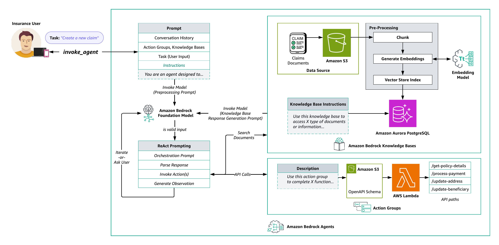

# Life Insurance Policy Management with Amazon Bedrock Agents and Knowledge Bases

## Managed Retrieval-Augmented Generation (RAG) Solution Using Aurora PostgreSQL with pg_vector for Policy Data and Knowledge Base Repository

### Content
- [Overview](#overview)
- [Agents and Knowledge Bases Architecture](#amazon-bedrock-agents-and-knowledge-bases-architecture)
- [Deployment Guide](#deployment-guide)
- [Testing and Validation](#testing-and-validation)
- [Cost Estimate](#cost-estimate)
- [Clean Up](#clean-up)

### Overview

This sample solution demonstrates how to use [Amazon Bedrock Agents](https://docs.aws.amazon.com/bedrock/latest/userguide/agents.html) and [Amazon Bedrock Knowledge Bases](https://docs.aws.amazon.com/bedrock/latest/userguide/knowledge-base.html) to create a specialized agent for life insurance policy management. The agent can interact with users in natural language, perform complex database queries using text-to-SQL capabilities, and access relevant information from a knowledge base.

The solution leverages [Amazon Aurora PostgreSQL](https://docs.aws.amazon.com/AmazonRDS/latest/AuroraUserGuide/Aurora.AuroraPostgreSQL.html) for policy data management and implements a knowledge base using [pg_vector](https://aws.amazon.com/about-aws/whats-new/2023/07/amazon-aurora-postgresql-pgvector-vector-storage-similarity-search/) for semantic similarity search. This architecture allows for seamless integration of structured policy data with unstructured knowledge base content, enabling the agent to provide comprehensive and accurate responses to user queries.

#### Key Features

- Amazon Bedrock Agents for policy management:
  - Natural language task orchestration
  - Action groups for API integrations
  - Text-to-SQL query generation
  - Complex workflow automation

- Amazon Bedrock Knowledge Base for life insurance-related queries:
  - RAG with Aurora PostgreSQL pg_vector
  - Automated document processing
  - Semantic search and retrieval
  - Dynamic context augmentation

- Integrated Architecture:
  - Aurora PostgreSQL for policy data and vectors
  - [AWS Lambda](https://docs.aws.amazon.com/lambda/latest/dg/welcome.html) functions for action group logic
  - [Streamlit](https://streamlit.io/) UI with [Amazon Cognito](https://docs.aws.amazon.com/cognito/latest/developerguide/cognito-user-pools.html) for user identity and access management
  - [Amazon CloudWatch](https://docs.aws.amazon.com/AmazonCloudWatch/latest/monitoring/WhatIsCloudWatch.html) monitoring and logging

### Amazon Bedrock Agents and Knowledge Bases Architecture

  

  <em>Diagram 1: Life Insurance Agent Architecture</em>

The workflow consists of the following steps:

1. Users interact with the Streamlit web interface to provide natural language inputs to the agent.

2. The agent processes the user input, using the underlying foundation model to undearstand the intent and required actions.

3. For policy-specific queries, the agent uses its text-to-SQL capability to generate appropriate SQL queries for the Aurora PostgreSQL database.

4. The knowledge base, implemented with pg_vector, is queried for general insurance information or policy details not stored in the structured database.

5. The agent orchestrates the necessary API calls, database queries, and knowledge base lookups to fulfill the user's request.

6. Finally, the agent synthesizes the gathered information into a coherent response for the user, which is displayed in the Streamlit interface.

### Deployment Guide
See [Deployment Guide](documentation/deployment-guide.md)

### Testing and Validation
See [Testing and Validation](documentation/testing-and-validation.md)

### Cost Estimate
See [Cost Estimate](documentation/cost-estimate.md)

### Clean Up
See [Clean Up](documentation/clean-up.md)

---

Copyright Amazon.com, Inc. or its affiliates. All Rights Reserved.
SPDX-License-Identifier: MIT-0
