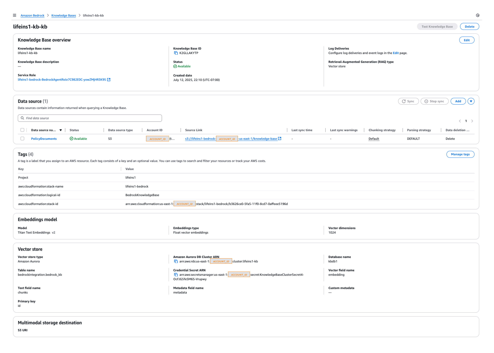
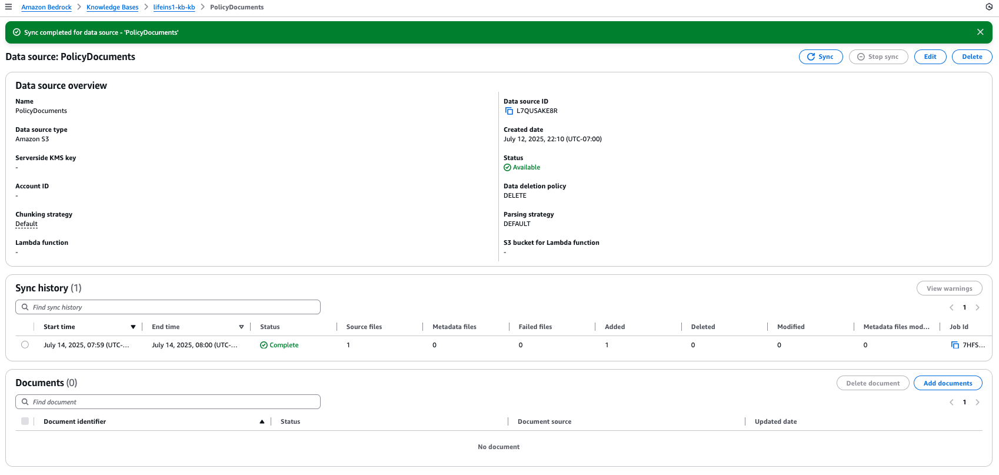
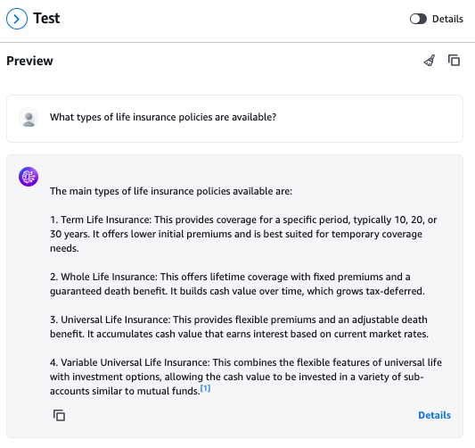
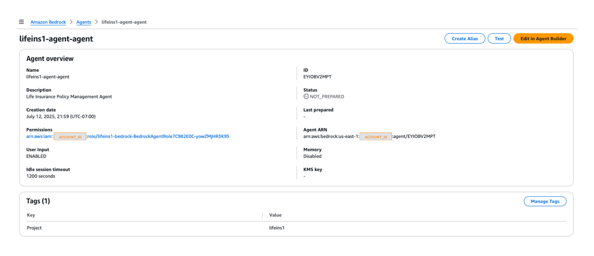
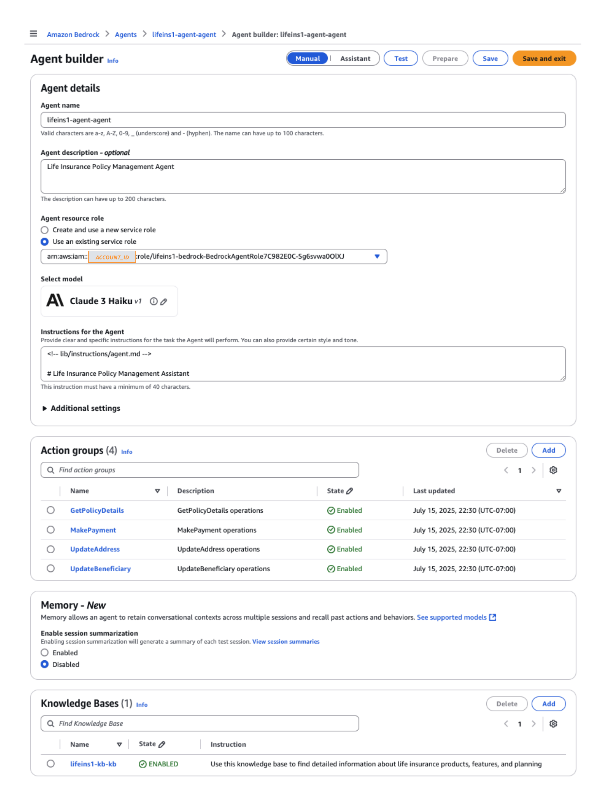
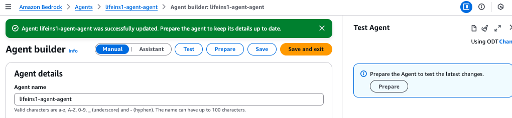
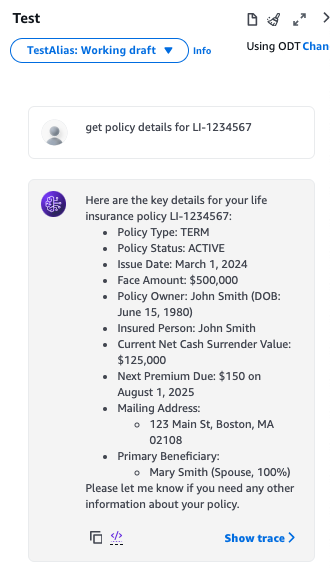

# Deployment Guide

## Content
- [Deployment Steps](#deployment-steps)
- [Post-Deployment Configuration](#post-deployment-configuration)
- [Context Configuration](#context-configuration)
- [CDK Overview](#cdk-overview)

## Deployment Steps

### 1. Verify Prerequisites

1. AWS Account and Access:
    - AWS credentials configured (`aws configure`)

2. Development Environment:
    - AWS CDK CLI (`npm install -g aws-cdk`)
    - Node.js 18.x or later
    - npm 9.x or later
    - Python 3.10 or later
    - pip (Python package manager)
    - Docker Desktop (for local container builds)
    - Git

3. Amazon Bedrock:
    - Model access enabled for:
      - Claude (Anthropic): Claude 3 Haiku / `anthropic.claude-3-haiku-20240307-v1:0`
      - Titan Embeddings: Titan Text Embeddings V2 / `amazon.titan-embed-text-v2:0`

### 2. Clone and Install

```bash
git clone <repository-url>
cd 8.3_Building_Your_Life_Insurance_Agent
npm install
```

> 💡 **Note**: If you are running from the Amazon SageMaker Notebook following [1.4 Setting up Your Cookbook Environment](../../../1_Getting_Started_with_AWS/1.4_Setting_up_Your_Cookbook_Environment/README.MD), the repository has been cloned when you lanuched the [AWS CloudFormation template](../../../1_Getting_Started_with_AWS/cfn/sagemaker-notebook-template.yaml).

From the Amazon SageMaker Notebook launched by [1.4 Setting up Your Cookbook Environment](../../../1_Getting_Started_with_AWS/1.4_Setting_up_Your_Cookbook_Environment/README.MD):

  - Go to [8.3_Building_Your_Life_Insurance_Agent](../../../8_Building_Your_First_GenAI_Application_with_AWS_Data_Foundations/README.md)
  - Click **[+]** button in the top-left corner of the JupyterLab console
  - Click **Terminal**

```bash
pwd
```

You should see `/home/ec2-user/SageMaker/db-cookbook/8_Building_Your_First_GenAI_Application_with_AWS_Data_Foundations/8.3_Building_Your_Life_Insurance_Agent`. If not, then,

```bash
cd /home/ec2-user/SageMaker/db-cookbook/8_Building_Your_First_GenAI_Application_with_AWS_Data_Foundations/8.3_Building_Your_Life_Insurance_Agent
```

Install the required packages.

```bash
npm install
```

### 3. Configure GitHub Connection

  - Navigate to the [AWS CodePipeline console](https://console.aws.amazon.com/codesuite/codepipeline/start)
  - In the left sidebar, click on **Settings** and then **Connections**
  - Click **Create connection**
  - Choose **GitHub** as the provider
  - Provice a name to the **Connection name**
  - Click **Connect to GitHub**
  - Click **Authorize AWS Connector for Github**
    - If prompted, sign in to your GitHub account
  - For **App installation**, choose **Install a new app**
  - Select the repository you want to connect
  - Review and click **Install & Authorize**
  - Click **Connect**
  - Note the ARN of the new connection
    - Need to provide the ARN in the next step 

### 4. Configure Context

**Option A: Automated Configuration (Recommended for SageMaker)**

Run the automated configuration script:

```bash
./configure-context.sh
```

The script will:
- Automatically detect your AWS account ID and region
- Verify the region has at least 3 availability zones
- Prompt for GitHub connection details
- Generate a unique app name to avoid conflicts
- Create a complete `cdk.context.json` configuration

**Option B: Manual Configuration**

Manually configure [`cdk.context.json`](../cdk.context.json) for your environment. Replace `<XXX>` with your own settings. Refer to [Context Configuration](#context-configuration) for details.

### 5. Deploy Infrastructure

The solution consists of three main CDK stacks, each responsible for a specific aspect of the architecture:

  - BedrockStack \[[`lib/bedrock-stack.ts`](../lib/bedrock-stack.ts)\]
  - StreamlitAppStack \[[`lib/streamlit-stack.ts`](../lib/streamlit-stack.ts)\]
  - CodePipelineStack \[[`lib/pipeline-stack.ts`](../lib/pipeline-stack.ts)\]

Refer to [CDK Overview](#cdk-overview) for details.

```bash
# Bootstrap CDK (first-time only)
cdk bootstrap

# Build the project (compiles TypeScript to JavaScript)
npm run build

# Deploy all stacks
cdk deploy --all --force --require-approval never --ci --context-from-config cdk.context.json --profile <YOUR_AWS_CLI_PROFILE>
```

## Post-Deployment Configuration

### 1. Knowledge Base Configuration

Navigate to the [Amazon Bedrock console](https://us-east-1.console.aws.amazon.com/bedrock/home?region=us-east-1#/) to configure the knowledge base:

1. Go to Knowledge Bases > [Your KB]
  <p align="center">
    
    <em>Figure 1: Knowledge Base Configuration</em>
  </p>

2. Select the data source then choose "Sync" to start ingestion:
  <p align="center">
    
    <em>Figure 2: Knowledge Base Data Source Configuration</em>
  </p>

The knowledge base data source sync automatically:
- Processes documents from S3
- Generates embeddings using the configured embeddings model
- Creates vector store entries in Aurora PostgreSQL using pg_vector

3. Navigate to Bedrock > Knowledge bases > [Your KB] > Test Knowledge Base

4. Configure test settings:
  <p align="center">
    
  </p>
  <p align="center">
    <em>Figure 3: Knowledge Base Test Configuration</em>
  </p>

   - **Model**: Claude 3 Haiku
   - **Deployment**: On-demand
   - **Max tokens**: 200k
   - **Provider**: Anthropic

5. Verify document processing with sample queries:
```
What types of life insurance policies are available?
```
```
How does cash value work in a whole life policy?
```
```
What factors affect premium costs?
```

<p align="center">
  
</p>
<p align="center">
  <em>Figure 4: Knowledge Base Testing</em>
</p>

### 2. Agent Configuration

Once knowledge base syncing completes:

1. Go to Agents > [Your agent]
<p align="center">
  
  <em>Figure 5: Agent Configuration</em>
</p>

2. Select "Edit in Agent Builder" to see agent details:
<p align="center">
  
  <em>Figure 6: Agent Builder</em>
</p>

3. Save any changes to the agent, then select "Prepare" to package changes:
  <p align="center">
    
    <em>Figure 7: Agent Save and Prepare</em>
  </p>

4. Navigate to Bedrock > Agents > [Your Agent] > Test Agent
5. Sample prompts:
```
get policy details for LI-1234567

make payment
[complete payment dialogue]

update beneficiary information
[complete beneficiary dialogue]

update address
[complete address dialogue]
```

<p align="center">
  
</p>
<p align="center">
  <em>Figure 8: Agent Testing</em>
</p>


## Troubleshooting

Common issues and solutions:

1. Knowledge Base Sync Failures:
   - Verify S3 bucket permissions
   - Check document format compatibility
   - Review ingestion job logs

2. Agent Preparation Issues:
   - Confirm action group configurations
   - Verify Lambda function permissions
   - Check OpenAPI schema validity

3. Database Connection Problems:
   - Verify security group rules
   - Check secrets manager access
   - Validate network connectivity

For detailed error resolution, refer to the [Amazon CloudWatch log groups](https://us-east-1.console.aws.amazon.com/cloudwatch/home?region=us-east-1#logsV2:log-groups).

## Context Configuration

The solution uses `cdk.context.json` to configure deployment parameters. Each section controls specific aspects of the infrastructure deployment.

```json
{
  // Application-level configuration
  "app": {
    "name": "lifeins1",                // Base name for resource prefixing
    "title": "Product Search Assistant",  // Application display name
    "icon": "🔍",                      // UI icon for application
    "chatPrompt": "How can I help?"    // Default chat interface prompt
  },

  // Bedrock AI service configuration
  "bedrock": {
    "agent": {
      "foundationModel": "anthropic.claude-3-haiku-20240307-v1:0",  // Bedrock foundation model for agent
      "idleSessionTTLInSeconds": 3600,  // Session timeout
      "maxTokens": 2048,               // Maximum response length
      "temperature": 0,                // Response randomness (0=deterministic)
      "topP": 0.9,                    // Nucleus sampling threshold
      "numResults": 5                  // Number of completion candidates
    },
    "knowledge_base": {
      "embeddingModel": "amazon.titan-embed-text-v2:0"  // Model for vector embeddings
    }
  },

  // Authentication and user management
  "cognito": {
    "userPoolName": "lifeins1-user-pool",  // User pool identifier
    "secrets_manager_id": "lifeins1-cognito-params",  // Secrets storage location
    "tempPassword": "ChangeMe123!"          // Initial user password
  },

  // Network architecture configuration
  "vpc": {
    "cidr": "10.0.0.0/16",            // VPC address range
    "maxAzs": 3,                      // Number of Availability Zones
    "natGateways": 1,                 // NAT Gateways for private subnet access
    "subnetConfiguration": {
      "public": {
        "cidrMask": 24,               // Public subnet size
        "name": "Public"              // Public subnet identifier
      },
      "private": {
        "cidrMask": 24,               // Private subnet size
        "name": "Private"             // Private subnet identifier
      },
      "isolated": {
        "cidrMask": 24,               // Isolated subnet size
        "name": "Isolated"            // Isolated subnet identifier
      }
    }
  },

  // Database configurations
  "databases": {
    "policy": {
      "cluster": {
        "identifier": "lifeins1-policy",  // Aurora cluster name
        "name": "policydb1"               // Database name
      },
      "schema": "policyschema",           // Database schema
      "tables": {
        "policies": "lifeins1_policies",           // Policy details table
        "premiums": "lifeins1_premiums",          // Premium schedules table
        "addresses": "lifeins1_addresses",        // Address history table
        "beneficiaries": "lifeins1_beneficiaries", // Beneficiary info table
        "payment_history": "lifeins1_payment_history", // Payment records table
        "payment_methods": "lifeins1_payment_methods"  // Payment methods table
      }
    },
    "knowledge": {
      "cluster": {
        "identifier": "lifeins1-kb",     // Knowledge base cluster name
        "name": "kbdb1"                  // Knowledge base database name
      },
      "schema": "bedrockintegration",    // KB schema name
      "tables": {
        "bedrock_kb": "bedrock_kb",      // Vector embeddings table
        "documents": "kb_documents",      // Source document table
        "categories": "kb_categories",    // Document category table
        "document_categories": "kb_document_categories" // Category mappings
      }
    }
  },

  // Storage configurations
  "dynamodb": {
    "feedback_table_name": "lifeins1-feedback",      // User feedback storage
    "chat_history_table_name": "lifeins1-chat-history" // Conversation storage
  },

  // S3 storage configuration
  "s3": {
    "bucketName": "lifeins1-{account}-{region}",  // Unique bucket naming
    "folders": {
      "agent": "agent",           // Agent configuration storage
      "docs": "documents",        // Documentation storage
      "assets": "assets",         // Web assets storage
      "knowledgeBase": "knowledge-base" // Knowledge base documents
    }
  },

  // Container deployment configuration
  "container": {
    "port": 8501,                // Streamlit application port
    "memory": 4096,              // Container memory allocation (MB)
    "cpu": 1024,                 // Container CPU allocation
    "desired_count": 3           // Number of container instances
  },

  // Content delivery configuration
  "cloudfront": {
    "custom_header_name": "X-Custom-Header",     // Security header name
    "custom_header_value": "your-secret-value-here" // Security header value
  },

  // Container registry configuration
  "ecr": {
    "repository_name": "lifeins1-streamlit" // Container image repository
  },

  // Source control configuration
  "github": {
    "owner": "<YOUR-GITHUB-OWNER>",     // GitHub repository owner
    "repo": "<YOUR-GITHUB-REPO>",       // Repository name
    "branch": "<YOUR-GITHUB-BRANCH>"             // Deployment branch
  },

  // CI/CD configuration
  "connection_arn": "arn:aws:codeconnections:us-east-1:<YOUR-ACCOUNT-ID>:connection/<YOUR-CONNECTION-ID>",

  // Regional availability configuration
  "availability-zones:account=<YOUR-ACCOUNT-ID>:region=us-east-1": [
    "us-east-1a",                // Primary AZ
    "us-east-1b",                // Secondary AZ
    "us-east-1c"                 // Tertiary AZ
  ]
}
```

Get back to the deployment step [4. Configure Context](#4-configure-context).

## CDK Overview

The solution consists of three main CDK stacks, each responsible for a specific aspect of the architecture:

### 1. BedrockStack \[[`lib/bedrock-stack.ts`](../lib/bedrock-stack.ts)\]

Core infrastructure stack that provisions:
- Networking infrastructure ([Amazon Virtual Private Cloud](https://docs.aws.amazon.com/vpc/latest/userguide/what-is-amazon-vpc.html) (VPC), subnets, endpoints)
- Data storage and processing:
  - Aurora PostgreSQL for policy data (T3.Medium)
  - Aurora PostgreSQL with pg_vector for knowledge base (R6g.Large)
  - [Amazon DynamoDB](https://docs.aws.amazon.com/amazondynamodb/latest/developerguide/Introduction.html) tables:
    - Chat history storage
    - User feedback tracking
- Amazon Bedrock integrations:
  - Agent with Claude foundation model
  - Knowledge Base with Titan embeddings
  - Action groups for policy operations
- Supporting components:
  - [Amazon Simple Storage Service](https://docs.aws.amazon.com/AmazonS3/latest/userguide/Welcome.html) (S3) bucket for agent assets and documents
  - Lambda functions for database initialization
  - [AWS Identity and Access Management](https://docs.aws.amazon.com/IAM/latest/UserGuide/introduction.html) (IAM) roles and [security groups](https://docs.aws.amazon.com/vpc/latest/userguide/vpc-security-groups.html)

### 2. StreamlitAppStack \[[`lib/streamlit-stack.ts`](../lib/streamlit-stack.ts)\]

Application deployment stack that handles:
- Container orchestration:
  - [Amazon Elastic Container Service](https://docs.aws.amazon.com/AmazonECS/latest/developerguide/Welcome.html) (ECS) Fargate cluster (3 tasks)
  - [Amazon Application Load Balancer](https://docs.aws.amazon.com/elasticloadbalancing/latest/application/introduction.html) (ALB)
  - Auto-scaling configuration
- Security and authentication:
  - Cognito User Pool
  - SSL/TLS termination
  - Security groups
- Content delivery:
  - [Amazon CloudFront](https://docs.aws.amazon.com/AmazonCloudFront/latest/DeveloperGuide/Introduction.html) distribution
  - Origin access controls

### 3. CodePipelineStack \[[`lib/pipeline-stack.ts`](../lib/pipeline-stack.ts)\]

Continuous deployment stack that implements:
- Source control integration:
  - GitHub repository connection
  - Branch and trigger configuration
- Container build pipeline:
  - [AWS CodeBuild](https://docs.aws.amazon.com/codebuild/latest/userguide/welcome.html) for Streamlit application
  - [Amazon Elastic Container Registry](https://docs.aws.amazon.com/AmazonECR/latest/userguide/what-is-ecr.html) (ECR) repository management
  - [AWS CodePipeline](https://docs.aws.amazon.com/codepipeline/latest/userguide/welcome.html) orchestration
- Automated deployment:
  - ECS service updates
  - Blue/green deployment
  - Rollback capabilities

Get back to the deployment step [5. Deploy Infrastructure](#5-deploy-infrastructure).

### Next: Testing and Validation
Continue to [Testing and Validation](testing-and-validation.md).

---

Copyright Amazon.com, Inc. or its affiliates. All Rights Reserved.
SPDX-License-Identifier: MIT-0
