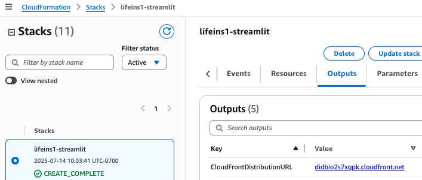
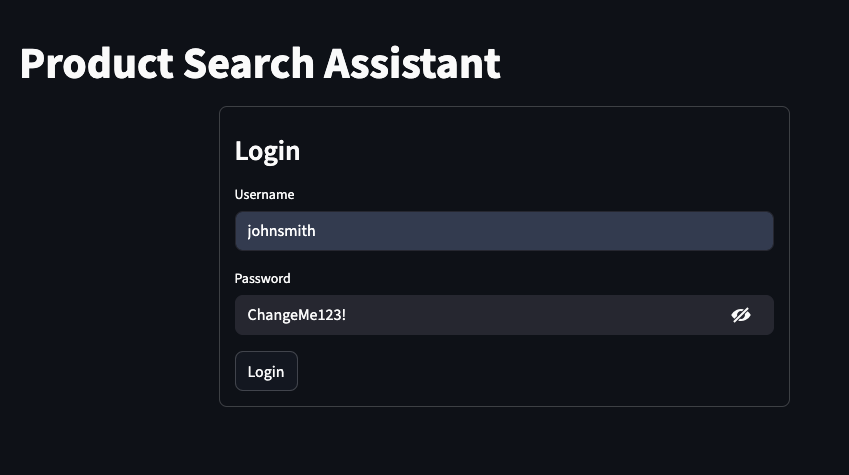
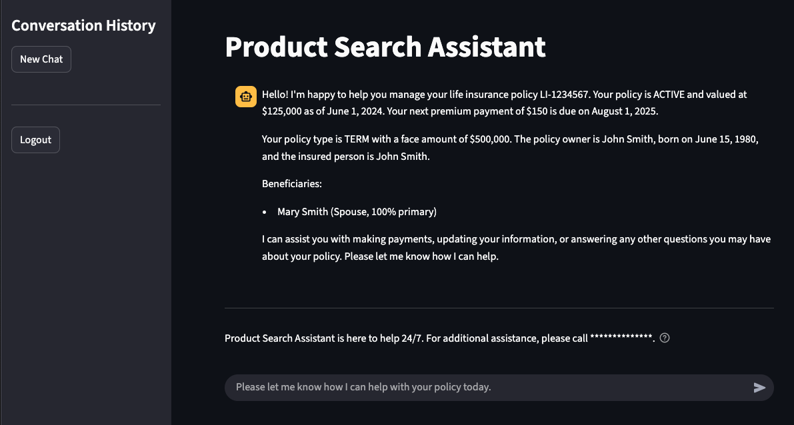
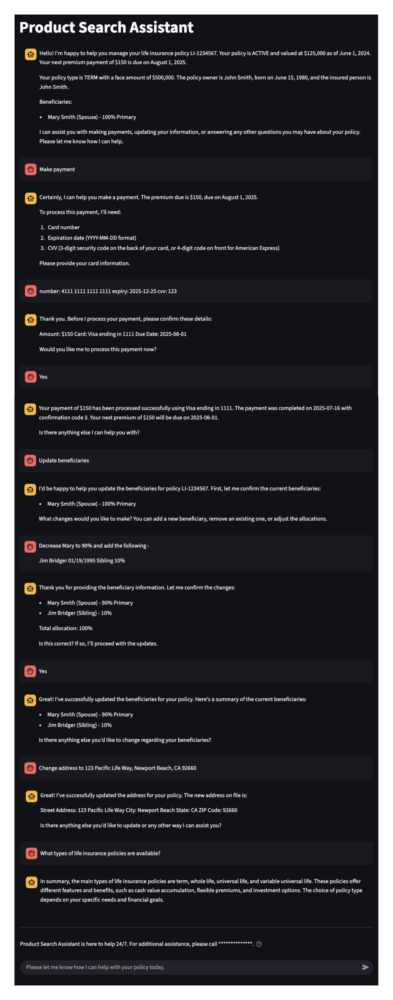

# Testing and Validation
---

## Content
- [Sample Data Loading and Authentication Flow](#sample-data-loading-and-authentication-flow)
- [Assessment Measures and Evaluation Technique](#assessment-measures-and-evaluation-technique)
- [Streamlit Web UI Testing](#streamlit-web-ui-testing)

## Sample Data Loading and Authentication Flow

### Custom Resource for Sample Data Loading

The solution uses a custom resource in the BedrockStack CDK stack to load sample policy data into the Aurora PostgreSQL policy database. This process ensures that test data is available immediately after deployment.

1. **Custom Resource Implementation:**
   - A Lambda function `LoadSampleDataFunction` is created in [`lib/bedrock-stack.ts`](../lib/bedrock-stack.ts).
   - This function uses the code from [`lambda/load-sample-data/index.py`](../lambda/load-sample-data/index.py).
   - It reads sample policy data from [`lambda/shared/sample-data/policy_data.json`](../lambda/shared/sample-data/policy_data.json).
   - On stack creation/update, the function is triggered to populate both the policy and knowledge base databases.

2. **Sample Data Structure:**
   The sample data includes policy information such as:
   - Policy number
   - Policy holder details
   - Coverage amounts
   - Premium information
   - Beneficiary details

### Unifying Policy ID Attribute

A crucial aspect of the solution is the unifying policy ID attribute that links the policy database with Cognito user accounts.

1. **Cognito Custom Attribute:**
   - A custom attribute `custom:policy_number` is added to the Cognito user pool.
   - This attribute stores the policy number associated with each user.

2. **Policy Database Integration:**
   - The `policy_number` in the database corresponds to the `custom:policy_number` in Cognito.

### Authentication and Policy Retrieval Flow

1. **User Authentication:**
   - User logs in through the Streamlit interface using Cognito credentials.
   - Upon successful authentication, Cognito returns the user's attributes, including `custom:policy_number`.

2. **Policy Data Retrieval:**
   - The Streamlit app uses the `custom:policy_number` to query the policy database.
   - This allows the app to display personalized policy information immediately after login.

## Assessment Measures and Evaluation Technique

When testing the life insurance policy management agent, focus on its ability to accurately retrieve and manipulate policy data based on authenticated user information. Evaluate the agent's performance in the following areas:

1. **Authentication and Policy Association**
2. **Policy Information Retrieval**
3. **Policy Updates and Modifications**
4. **General Insurance Knowledge Integration**

## Streamlit Web UI Testing

### Accessing the Application

1. **Locate the CloudFront URL:**
   
   Option 1 - CloudFormation Outputs:
   - Navigate to the AWS CloudFormation console
   - Select the `lifeins1-streamlit` stack
   - Go to the "Outputs" tab
   - Find the output key `CloudFrontDistributionURL`
   - Copy the associated value (e.g., `d1234abcdef.cloudfront.net`)

   <p align="center">
     
   </p>
   <p align="center">
     <em>Figure 9: CloudFormation Output with CloudFront URL</em>
   </p>

   Option 2 - AWS CLI:
   ```bash
   aws cloudformation describe-stacks \
     --stack-name lifeins1-streamlit \
     --query 'Stacks[0].Outputs[?OutputKey==`CloudFrontDistributionURL`].OutputValue' \
     --output text
   ```

2. **Access the Application:**
   - Open a web browser and navigate to the CloudFront URL
   - You should see the Streamlit login page

   <p align="center">
     
   </p>
   <p align="center">
     <em>Figure 10: Streamlit Authentication</em>
   </p>

### Streamlit Features and Helper Libraries

<p align="center">
  
  <em>Figure 11: Streamlit Chat Interface</em>
</p>

The Streamlit application [`app/streamlit/streamlit_app.py`](../app/streamlit/streamlit_app.py) utilizes several custom modules:

1. **Authentication** [`app/streamlit/utils/auth.py`](../app/streamlit/utils/auth.py):
   - Manages user login/logout
   - Fetches and stores user attributes

2. **Bedrock Service** [`app/streamlit/utils/bedrock.py`](../app/streamlit/utils/bedrock.py):
   - Handles interactions with Amazon Bedrock
   - Manages rate limiting and retries

3. **Chat History** [`app/streamlit/utils/chat_history.py`](../app/streamlit/utils/chat_history.py):
   - Stores and retrieves conversation history using DynamoDB

### User Credentials

Two sample users are created during deployment:

1. **User 1:**
   - Username: `johnsmith`
   - Password: `ChangeMe123!`
   - Policy Number: `LI-1234567`

2. **User 2:**
   - Username: `janedoe`
   - Password: `ChangeMe123!`
   - Policy Number: `LI-7654321`

### Testing Prompts

To comprehensively test both the agent and knowledge base capabilities, refer to the following sample prompts:

### Policy Information Queries:
```
What's the current cash value of my policy?
```
```
When is my next premium payment due?
```
```
Who are the beneficiaries on my policy?
```

### Policy Updates:
```
I want to change my beneficiary. How do I do that?
```
```
Can I increase my coverage amount?
```
```
I need to update my address. What information do you need?
```

### Payment Processing:
```
I'd like to make a payment on my policy.
```
```
What payment methods are available for my premium?
```
```
Can I set up automatic payments?
```

### General Insurance Knowledge:
```
What's the difference between term and whole life insurance?
```
```
How does cash value work in a life insurance policy?
```
```
Can you explain what a rider is in life insurance?
```

### Combination Queries:
```
What's my current death benefit, and how does it compare to the industry average?
```
```
Given my current premium, what factors would affect increasing my coverage?
```
```
Based on my policy type, what are some recommended riders I should consider?
```

### Error Handling and Edge Cases:
```
Can you tell me about policy LI-9999999?
```
```
I want to make changes to my wife's policy.
```
```
What's the current market price of Amazon stock?
```

### Testing Workflow

1. Log in with one of the provided user credentials
2. Verify that the correct policy information is displayed
3. Use the prompts to test various aspects of the agent and knowledge base
4. Check the conversation history feature in the sidebar
5. Log out and log in as the other user to test multi-user functionality
6. Verify that policy information and chat history are correctly isolated between users

Remember to test both the agent's ability to handle policy-specific tasks and its integration with the knowledge base for general insurance information.

### Example Interaction Flow

The following is a complete example showing the agent's core functionality to:
- Maintain context across multiple operations
- Handle complex multi-step processes
- Provide clear confirmations
- Integrate policy-specific data with general knowledge
- Maintain a conversational yet professional tone

<p align="center">
  
  <em>Figure 12: Complete Interaction Flow Example</em>
</p>

### (OPTIONAL) Next: Clean Up
Continue to [Clean Up](clean-up.md).

---

Copyright Amazon.com, Inc. or its affiliates. All Rights Reserved.
SPDX-License-Identifier: MIT-0