# 8.4 Healthcare database system natural language search

This solution showcases how a Bedrock-powered Streamlit application can enable healthcare professionals to query complex databases using natural language, without requiring SQL expertise. By leveraging a robust AWS infrastructure—Amazon Aurora PostgreSQL for scalable data storage, AWS Lambda for automated metadata extraction, and Amazon S3 for centralized metadata storage—the application ensures high availability, performance, and secure data handling. AWS Secrets Manager adds another layer of security by managing sensitive credentials, allowing seamless and secure access to database resources.

Through this application, users can intuitively interact with their healthcare system’s data by simply entering questions in natural language. The application retrieves metadata and credentials, constructs a prompt, and uses a Bedrock foundation model to generate accurate SQL queries tailored to the database structure. The results are then translated into clear, actionable insights presented directly to the user. This approach empowers organizations to democratize data access, reduce reliance on technical teams, and streamline clinical or operational decision-making in a secure and scalable environment.

## Topics

- [Technical / Architecture Overview](#technical--architecture-overview)
  - [Infrastructure](#infrastructure)
  - [Application Flow](#application-flow)
- [Cost](#cost)
  - [Amazon EC2 and EBS](#amazon-ec2-and-ebs-ec2-pricing-ebs-pricing)
  - [Amazon S3](#amazon-s3-pricing)
  - [AWS Lambda](#aws-lambda-pricing)
  - [Amazon Bedrock](#amazon-bedrock-pricing)
  - [Total Monthly Solution Cost](#total-monthly-solution-cost)
- [Deployment Guide](#deployment-guide)
  - [1. Clone the Repository](#1-clone-the-repository)
  - [2. Deploy CloudFormation Stack](#2-deploy-cloudformation-stack)
  - [3. Deploy Application Code](#3-deploy-application-code)
  - [4. Access the Application](#4-access-the-application)
  - [5. Verify Functionality](#5-verify-functionality)

## Technical / Architecture Overview

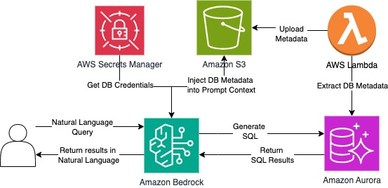

### Infrastructure

* Amazon Aurora PostgreSQL serves as the primary relational database, offering high availability, scalability, and low-latency performance. Its fully managed nature ensures automated backups, fault tolerance, and seamless scalability, making it ideal for healthcare data workloads.
* AWS Lambda functions as a serverless compute layer responsible for extracting schema metadata from the Aurora database. This metadata is periodically captured and transformed into a format suitable for language model prompting.
* Amazon S3 acts as a centralized and durable storage layer for the extracted database metadata. By decoupling metadata storage from compute and database layers, S3 supports flexible, low-cost access patterns for downstream applications.
* AWS Secrets Manager securely stores and manages sensitive database credentials. It provides secure, programmatic access to these credentials during query execution, enabling tight access control and auditability.

### Application Flow
Users interact with the system through a Streamlit-based web application, where they can submit natural language queries related to the healthcare system’s data.
1. User Interaction: A user accesses the Streamlit-based web application and enters a natural language query related to the healthcare system’s data.
2. Credential Retrieval: The application securely fetches database credentials from AWS Secrets Manager to authorize subsequent data access.
3. Metadata Retrieval: Retrieves the latest database metadata—previously extracted and stored via Lambda— from Amazon S3. This metadata includes table names, column types, and relationships necessary for query generation.
4. Prompt Construction: Using the retrieved metadata and the user’s input, the application constructs a structured prompt tailored for the Amazon Bedrock foundation model.
5. SQL Generation: The Bedrock model processes the prompt and generates a context-aware SQL query that aligns with the user’s intent and the structure of the underlying database.
6. Query Execution: The application executes the generated SQL query against the Amazon Aurora PostgreSQL database and fetches the resulting data.
7. Natural Language Response: The results are analyzed and converted into a user-friendly, natural language summary, which is then displayed within the Streamlit interface.

## Cost

You are responsible for the cost of the AWS services used while running this sample solution. As of May 2025, the cost for running this solution with the specified settings in the us-east-1 (N. Virginia) AWS Region is approximately $304.43 per month based on the following assumptions.

### Amazon EC2 and EBS ([EC2 Pricing](https://aws.amazon.com/ec2/pricing/), [EBS Pricing](https://aws.amazon.com/ebs/pricing/)):
t3.medium instance:

* Cost: $0.0416 per hour.
* Estimated monthly storage cost: $0.0416/hour * 744 hours = $30.95

gp2 storage:

* gp2 Cost: $0.10 per GB-month
* Estimated monthly storage cost: $0.1/GB-month * 100Gb = $10.00

Total cost of EC2 + EBS: $30.95 + $10.00 = $40.95

### Amazon S3 ([Pricing](https://aws.amazon.com/s3/pricing/)):

Storage:

* Volume: 0.1 TB (102.4 GB) of data in the S3 Standard storage class.
* Storage Cost: $0.023 per GB-month.
* Estimated monthly storage cost: $0.023/GB-month * 102.4 GB = $2.35

Data Transfer:

* Volume: 0.1 TB (102.4 GB) of data transfer out per month.
* Data Transfer Cost: $0.09 per GB for the first 10 TB.
* Estimated monthly data transfer cost: $0.09/GB * 102.4 GB = $9.21

Requests:

* GET Requests: 100,000 requests at $0.0004 per 1,000 requests.
* PUT Requests: 100,000 requests at $0.005 per 1,000 requests.
* Estimated monthly requests cost:
        * 
    - GET: $0.0004 * (100,000 / 1,000) = $0.04
    - PUT: $0.005 * (100,000 / 1,000) = $0.50
    - Total requests cost: $0.40 + $5.00 = $0.54

Total Amazon S3 Cost:

* Storage: $2.35
* Data Transfer: $9.21
* Requests: $054
* Total: $12.11

### AWS Lambda ([Pricing](https://aws.amazon.com/lambda/pricing/)):

Compute: the use of Lambda in the solution is very little, the cost is ignorable.

* Invocation Count: 100 invocations per month.
* Duration: 0.5 seconds on average.
* Total Execution Time: 50 seconds per month.
* Memory: 128 MB.
* Total GB-Seconds: 50 * 128 MB / 1024 = 6.25 GB-Seconds.
* Cost: $0.0000166667 per GB-second.
* Estimated monthly cost: $0.0000166667 * 6.25 GB-Seconds ~=0

Total AWS Lambda Cost: $0


### Amazon Bedrock ([Pricing](https://aws.amazon.com/bedrock/pricing/)):

Model:

* Selection: Anthropic Claude 3.7 Sonnet.
* Usage Volume: 3,000,000 tokens per month.
* Price per 1,000 input tokens: $0.003
* Price per 1,000 output tokens: $0.015

Tokens:

* Input Tokens: 100,000 tokens/day * 30 days = 3,000,000 tokens/month.
* Output Tokens: 100,000 tokens/day * 30 days = 3,000,000 tokens/month.
* Cost for input tokens: $0.003 * (3,000,000 / 1,000) = $9.00
* Cost for output tokens: $0.015 * (3,000,000 / 1,000) = $45.00

Total Agents Cost: $54.00


### Total Monthly Solution Cost

Summing up all the individual costs:

* Amazon EC2 and EBS Cost: $40.95
* Amazon S3 Cost: $12.11
* AWS Lambda Cost: $0
* Agents and Knowledge Bases for Amazon Bedrock Cost: $54.00

Total Estimated Monthly Cost: $107.06


## Deployment Guide
### 1. Clone the Repository

`git clone <amazon-samples-repository-url>
 cd healthcare-data-explorer
`

### 2. Deploy CloudFormation Stack

**Navigate to AWS CloudFormation Console**

* Open AWS Console
* Search for "CloudFormation"
* Click "Create stack" > "With new resources (standard)"

**Upload Template**

* Select "Upload a template file"
* Click "Choose file"
* Select `Hcls-Cookbook-Version-Latest.yml` from cloned repository
* Click "Next"

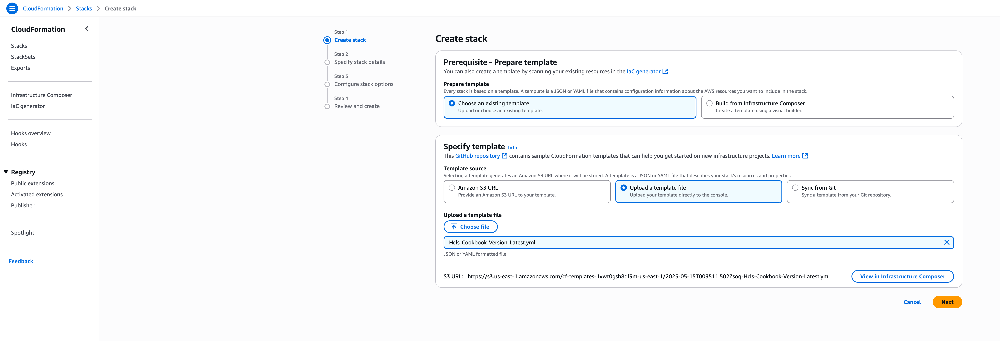

**Configure Stack**

* Stack name: CookbookLab
* Leave default parameters as is
* Click "Next"
* Click "Next" on Configure stack options
* Review and check acknowledgment for IAM resource creation
* Click "Create stack"

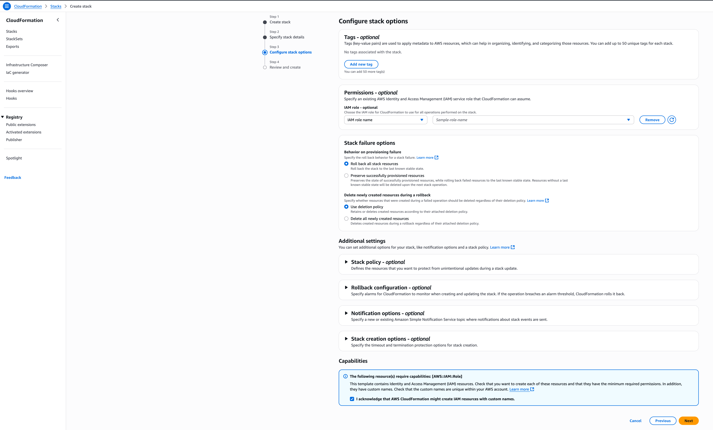
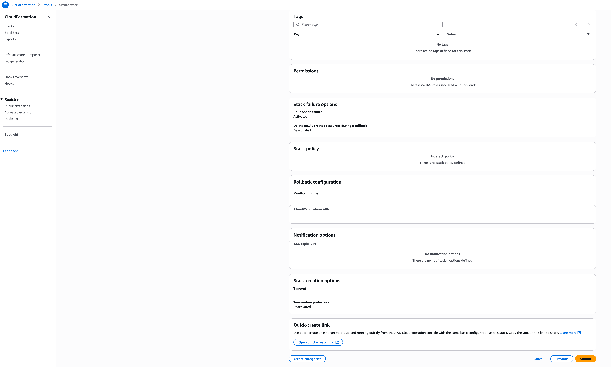

**Monitor Stack Creation**

* Wait for stack creation to complete (~25-30 minutes)
* Verify all resources are created successfully


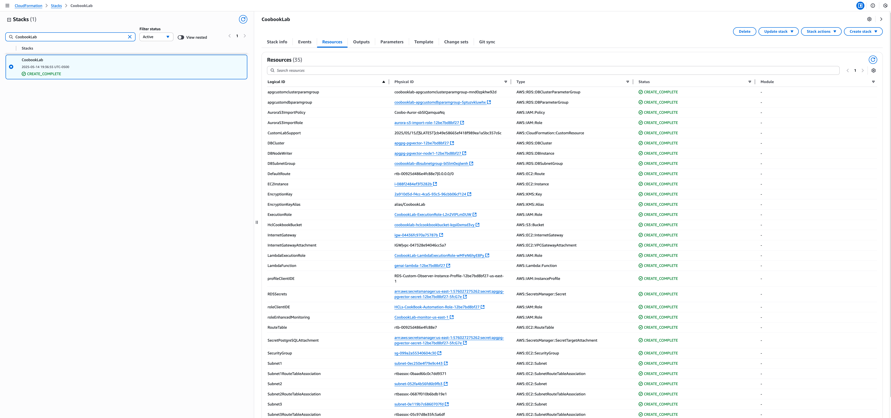

### 3. Deploy Application Code

**Connect to EC2 Instance**

* Open AWS Systems Manager Console
* Navigate to Session Manager
* Start session with the created EC2 instance

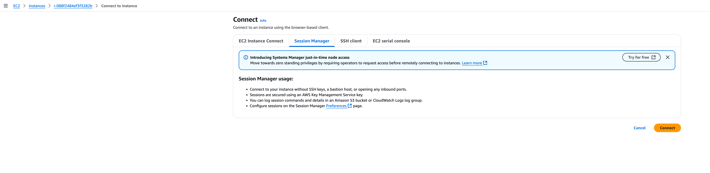


**Deploy Application Code**

```
# Create application file
vi app.py# Copy and paste the contents of app.py from the cloned repository
```

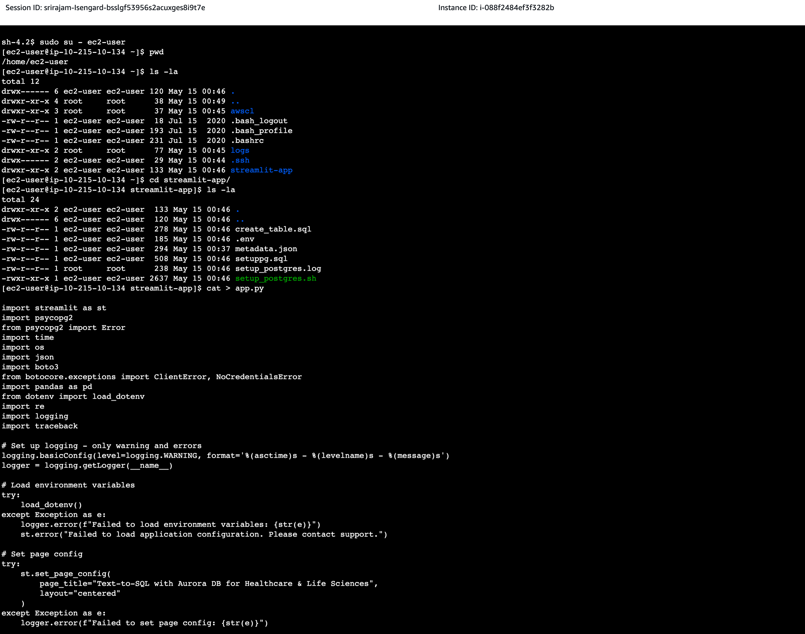

**Start the Application**

```
# Run Streamlit application
streamlit run app.py
```

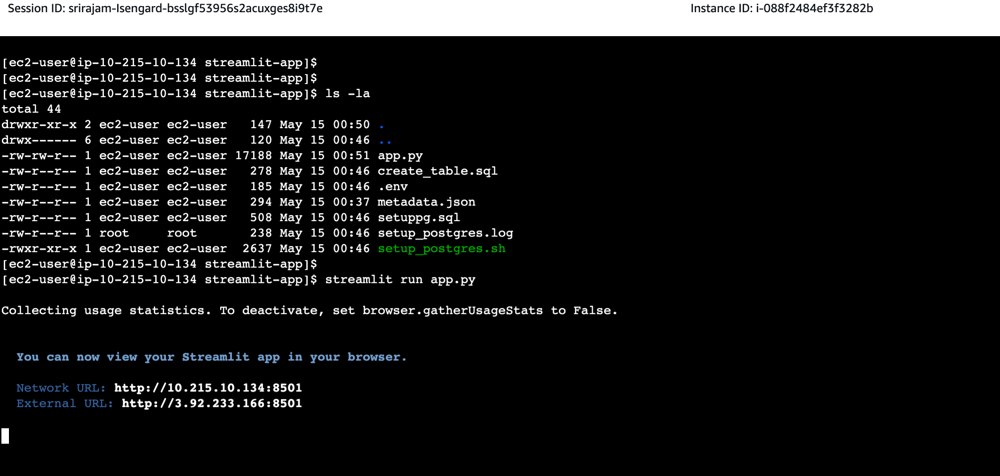


### 4. Access the Application

**Access Application**

* Open web browser
* Navigate to: `http://<ec2-public-ip>:8501`

**Important Note:**
Before accessing the application, you must configure the EC2 security group:

* Navigate to EC2 Console > Security Groups
* Find the security group attached to your EC2 instance
* Add inbound rule:
    - Type: Custom TCP
    - Port: 8501
    - Source: Your IP address (you can use 'My IP' option)
    - Description: Streamlit Access

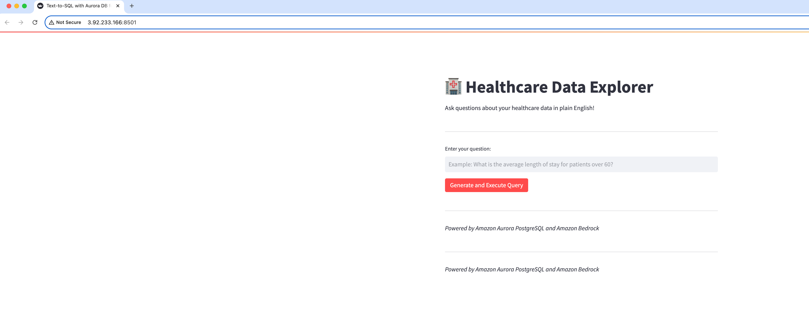

### 5. Verify Functionality

**Test the application by entering sample queries:**

* "What is the average length of stay for patients?"
* "Show me the top 5 diagnoses by frequency"

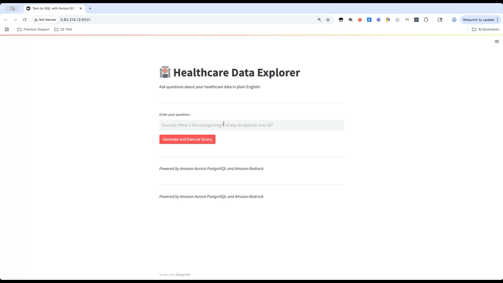

## Troubleshooting

If you encounter issues:

* Check CloudFormation stack events for deployment errors
* Verify EC2 instance status and security group rules
* Check Streamlit application logs on EC2 instance
* Verify Aurora PostgreSQL cluster connectivity

## Cleanup

**Empty S3 Bucket**

**Important Note:** S3 buckets must be empty before stack deletion

* Navigate to S3 Console
* Select the bucket created by the stack
* Click "Empty"
* Type "permanently delete" to confirm
* Click "Empty"

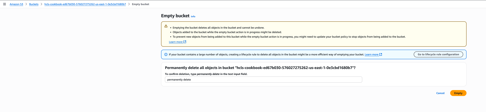

**Delete CloudFormation Stack**

* Navigate to CloudFormation Console
* Select the stack
* Click "Delete"
* Wait for stack deletion to complete

**Note:** Stack deletion will fail if the S3 bucket is not empty. Ensure you've completed above step before attempting stack deletion.

**Verify Resource Cleanup**

* Confirm all resources have been deleted
* Check EC2, RDS, S3, and Lambda consoles to ensure no resources remain

## Next Steps

🎉 **Revolutionary!** You've successfully built a healthcare database system with natural language search capabilities. This completes your journey through the AWS Database Cookbook.

To continue your learning and explore advanced topics, visit our [Conclusion and Next Steps](../../9_Conclusion_and_Next_Steps/README.md) section where you'll find:

- **Advanced Learning Paths**: Specialized tracks for different roles and use cases
- **Community Resources**: Connect with other AWS database practitioners
- **Certification Guidance**: Prepare for AWS database certifications
- **Real-World Case Studies**: Learn from production implementations
- **Latest Updates**: Stay current with new AWS database features

You now have the foundation to build sophisticated, AI-powered database applications on AWS!

## Learn More

- [Generative AI with Aurora Workshop - Build AI applications with vector databases](https://catalog.workshops.aws/genai-with-aurora/en-US)
- [Amazon Bedrock Workshop - Create generative AI applications with foundation models](https://catalog.workshops.aws/amazon-bedrock/en-US)
- [Aurora Machine Learning - Integrate ML models directly into database queries](https://docs.aws.amazon.com/AmazonRDS/latest/AuroraUserGuide/aurora-ml.html)
- [pgvector Extension Guide - Store and query vector embeddings in PostgreSQL](https://docs.aws.amazon.com/AmazonRDS/latest/AuroraUserGuide/AuroraPostgreSQL.Extensions.html)
